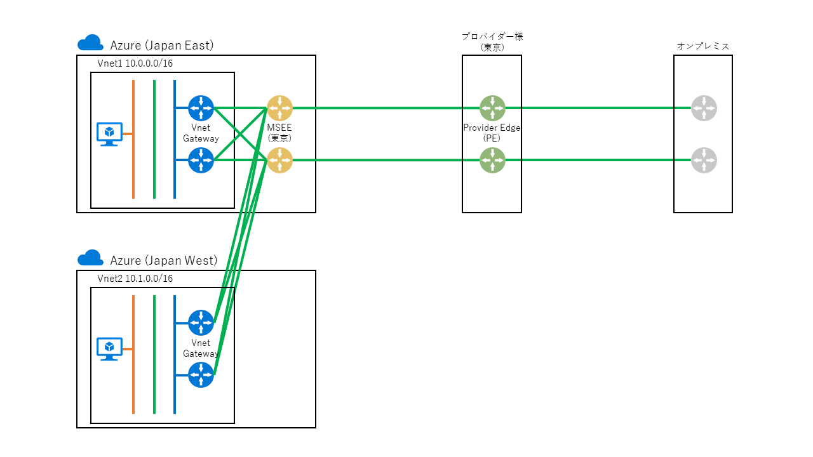
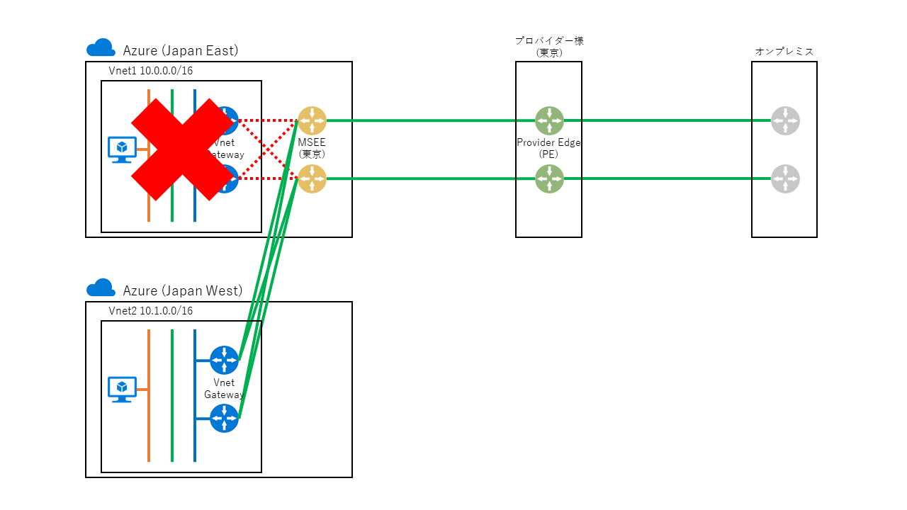
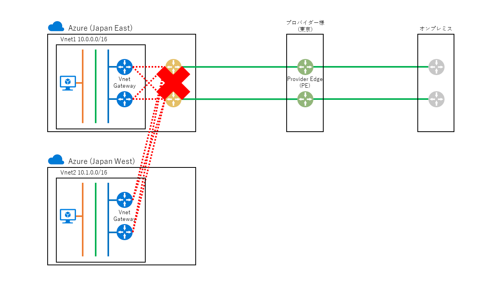
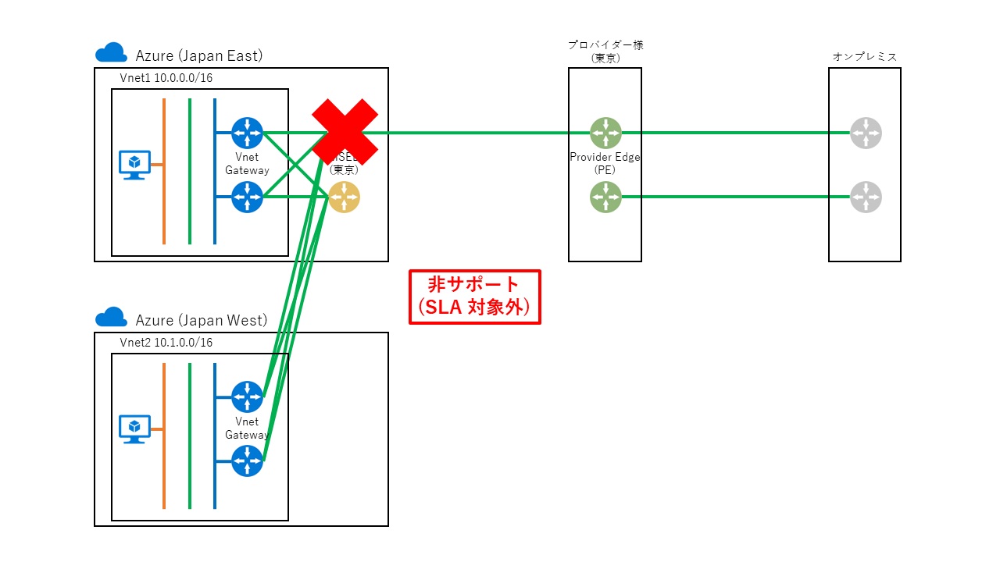
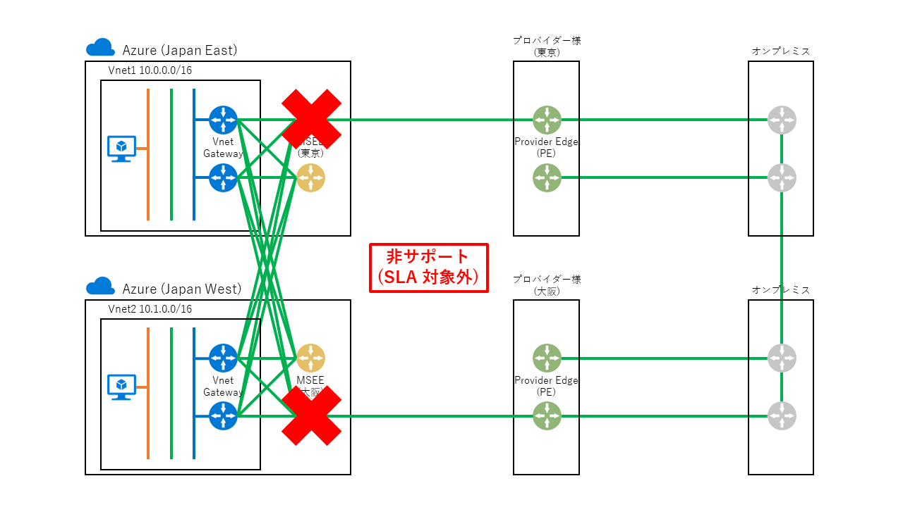

> [!WARNING]
> 本記事は、投稿より時間が経過しており、**一部内容が古い可能性があります。**

こんにちは。Azure サポートの宇田です。
今回は、ExpressRoute を複数ご契約いただく場合の留意点や、冗長構成の考慮点についてご説明します。

* [Part1: ExpressRoute を導入する前に](./archive/expressroute-deep-dive-part1.md)
* [Part2: ExpressRoute のルーティング制御について](./archive/expressroute-deep-dive-part2.md)
* [Part3: ExpressRoute の導入手順について](./archive/expressroute-deep-dive-part3.md)
* Part4: ExpressRoute の冗長構成について
* [Part5: ExpressRoute の増速やプロバイダー変更について](./archive/expressroute-deep-dive-part5.md)
* [Part6: ExpressRoute の各種上限値について](./network/expressroute-deep-dive-part6.md)

## 単一の ExpressRoute 回線を契約した場合

まず初めに、シンプルに 1 回線だけ契約された場合からご説明します。

ExpressRoute を東京でご契約いただいた場合、既定 (Premium Add-on なし) の状態で、以下の図のように東日本・西日本リージョンの仮想ネットワークに接続が可能です。

## ExpressRoute 回線を複数契約された場合

次に、ExpressRoute 回線を東京で 2 回線ご契約される場合を考えてみます。
(システム毎に回線を分離したい場合や、キャリア冗長としたい場合など)

以下のドキュメントに記載がある通り、1 つの仮想ネットワークには最大で 4 つまで ExpressRoute 回線を接続出来ます。
(異なる場所の ExpressRoute 回線であれば、最大 16 回線まで接続できます。)

* 1 つの仮想ネットワークを複数の ExpressRoute 回線に接続できますか。
https://docs.microsoft.com/ja-jp/azure/expressroute/expressroute-faqs#can-i-have-one-virtual-network-connected-to-more-than-one-expressroute-circuit

> はい。 1 つの仮想ネットワークを、同じ場所の最大 4 つの ExpressRoute 回線に、または異なるピアリングの場所の最大 16 の ExpressRoute 回線に接続できます。

なお、以前はすべて別の場所 (東京・大阪など) でご契約いただいた ExpressRoute  回線が必要でした。そのため、2 回線ともに東京でご契約いただいた場合、1 つの仮想ネットワークに東京の 2 つの ExpressRoute 回線を接続していただくことができませんでした。ただ、現在は制限が緩和され同一の場所で契約された複数の ExpressRoute 回線を接続可能になっていますので、特別な考慮は不要となりました。

## 大規模災害時などの疎通性の考え方

最後に、災害時の DR を考慮する際の留意点についてご説明します。

まず大前提として、Azure のリージョン (東日本・西日本リージョン) と、ExpressRoute の接続場所 (東京・大阪) は、必ずしも同一のデータセンター内とは限りません。(海外ですと、Azure リージョンが存在しない地域でも ExpressRoute の接続場所が用意されている場合がございます。)

* 地理的リージョン内の Azure リージョンと ExpressRoute の場所の対応
https://docs.microsoft.com/ja-jp/azure/expressroute/expressroute-locations#azure-regions-to-expressroute-locations-within-a-geopolitical-region

これを踏まえ、大規模災害時などに東京の ExpressRoute 回線経由で西日本リージョンの仮想ネットワークへ接続出来るのかという点ですが、どこが被災したかによって状況が異なりますので、以下にそれぞれご紹介できればと思います。

### Azure のデータセンターが被災した場合

データセンター側が被災したものの、ExpressRoute の接続場所 (MSEE) は無事という場合は、以下の図のように ExpressRoute 経由で西日本リージョンへ接続が可能と想定されます。

### ExpressRoute の接続場所 (MSEE) が被災した場合

一方で、ExpressRoute の接続場所が被災した場合は、以下の図のように MSEE 経由で西日本リージョンへ通信を行うことができなくなることが想定されます。

### ExpressRoute 回線自体も DR 対策を検討される場合

上記のような大規模災害時を想定し、ExpressRoute 回線の冗長化を検討される場合は、東京・大阪で 1 回線ずつご契約いただき、東日本・西日本リージョンの仮想ネットワークに対してメッシュでの接続をご検討ください。

この時、Azure とオンプレミス間は 2 つの経路で接続できる状態になりますが、既定の状態では等コストですので、アクティブ / アクティブな状態となり、両経路とも利用されることになります。

意図的に一方の経路を優先させたい (通常時は東京側を利用したい) という場合には、Azure からオンプレミスと、オンプレミスから Azure の双方向で、以下のように経路制御をいただければと思います。

* Azure -> オンプレミス方向の経路制御
Azure としては、プロバイダー様の PE ルーターから広報される BGP の経路情報に基づいてルーティングを行っています。
意図的に東京側を優先してオンプレミスへルーティングしたいという場合は、AS Path プリペンドでの経路制御をご検討ください。
具体的には、大阪の PE ルーターから広報する経路情報に AS Path を追加して、遠回りの経路と見せかけることで制御できますので、プロバイダー様 (L2 プロバイダー様の場合は、PE ルーターの管理者様) までご相談をいただければと思います。

* オンプレミス -> Azure 方向の経路制御
オンプレミス側で、東京・大阪のどちらの ExpressRoute 回線へルーティングするかは、お客様のネットワーク構成に依存します。
Azure 側からは制御できませんので、お手数ですがオンプレミス側のネットワーク管理者様や、プロバイダー様までご相談ください。

## 【補足】ExpressRoute 回線を片系のみで利用することは非サポート (SLA 対象外) です

稀に「ExpressRoute 回線を片系のみで利用してもよいか」といったお問い合わせをいただくことがありますが、**片系のみでの使用は SLA 対象外の非サポート構成となります**のでお控えください。

ExpressRoute 回線を片系のみで構成された場合、上記でご紹介しているような大規模な災害が発生した場合に限らず、平時のメンテナンス作業や、ハードウェア障害によって通信が長時間全断する恐れがあります。そうした事象が長期化した場合 (片系で運用されているために、通信の全断が長期化した場合) であっても、弊社としては一切の責任を負いかねます。また、メンテナンス作業の日時を延期したり、ご希望の日時に変更するといったことも一切できかねますのでご承知おきください。(MSEE のメンテナンス作業は、同一の MSEE に収容される他の全てのお客様にも影響いたしますので、個別のご要望はお受けいたしかねます。)

また、**東京と大阪で一回線ずつ、合計二回線を用意しているからといって、それぞれを片系で運用することもお控えください。**

弊社としては、各 ExpressRoute 回線が二系統で冗長化されていることを前提としてメンテナンスのスケジュールを計画しています。言い換えると、一つの ExpressRoute 回線の Primary / Secondary は別日程でメンテナンス作業を行うように計画されますが、異なる場所の ExpressRoute 回線が同時にメンテナンスされないという保証はございません。(ExpressRoute に限らず、多くのサービスでは東日本リージョンと西日本リージョン、東京と大阪のような対となる場所で同時にメンテナンスを行うことは回避される傾向にあります。ただ、ExpressRoute 回線のメンテナンス作業が東京・大阪で絶対に同時ではないとは保証いたしておりません。)

以上、ご参考になりましたら幸いです。
