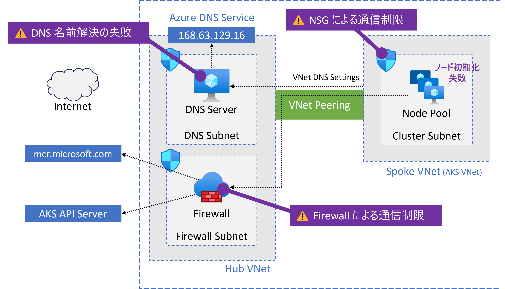
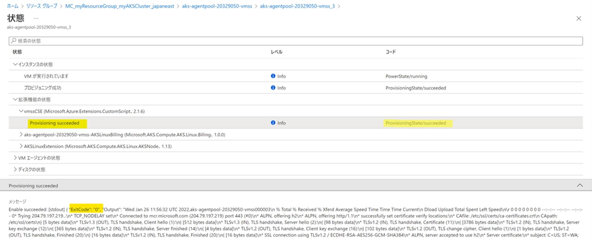

こんにちは。Azure テクニカル サポートチームの桐井です。

[Azure Kubernetes Service (AKS)](https://learn.microsoft.com/ja-jp/azure/aks/intro-kubernetes) クラスターで、ノードの新規作成が成功しない事象や、停止したクラスターの起動が成功しないといった事象が発生することがございます。

このような事象は、ノードの初期化が成功していない場合に発生するもので、弊社サポート事例においても多くのお客様よりご相談をいただくことがございます。

本記事では、AKS ノードの初期化を担う vmssCSE 拡張機能についての解説と、ノード初期化が成功しない代表的な要因とトラブルシューティング方法について紹介します。

<!-- more -->

---

## vmssCSE 拡張機能とは

AKS クラスターのノードには VMSS インスタンスが使用されています。AKS ノードを作成すると、それに応じて VMSS インスタンスが作成されます。

vmssCSE 拡張機能は、VMSS インスタンスを AKS ノードとして利用可能な状態にするために初期化する役割を担います。
[Azure 仮想マシンの拡張機能](https://learn.microsoft.com/ja-jp/azure/virtual-machines/extensions/overview)を利用して、AKS ノードの初期化をするスクリプトが実行されます。
vmssCSE は VMSS (Virtual Machine Scale Set) Custom Script Extension の略称です。

初期化スクリプトが実行されると、はじめに、[AKS ノードに必要なネットワーク要件](https://learn.microsoft.com/ja-jp/azure/aks/outbound-rules-control-egress#required-outbound-network-rules-and-fqdns-for-aks-clusters)が満たされているか検証されます。
AKS のAPI サーバーや、システム コンポーネントの取得元となるコンテナー レジストリに対してアクセス可能か検証し、必要な通信ができる状態であるかチェックされます。
その後、AKS ノードとして動作させるために必要なコンポーネント (kubelet や CNI プラグインなど) がダウンロードされ、VMSS インスタンスにインストールされます。
インストールが完了すると、AKS クラスターにノードが追加されます。

vmssCSE 拡張機能は、Azure 仮想マシンのプロビジョニング プロセスの一部として実行されます。
何らかの要因によって vmssCSE 拡張機能によるノードの初期化が成功しなかった場合には、新規作成された AKS ノードの起動が完了しない状態となります。

vmssCSE 拡張機能によるノードの初期化が成功しないと、次のような事象が発生します。

* AKS クラスターの作成失敗
* AKS クラスターやノードプールのアップグレード失敗
* ノードプール追加やスケールアウト失敗
* 停止された AKS クラスターの起動失敗

ノードの初期化が成功しない理由の多くは、ネットワーク通信に関連する要因です。
特に、ファイアーウォールやカスタム DNS サーバーなど、ネットワーク構成をカスタマイズしている環境において、AKS クラスターの動作に必要な通信が成功しないことによって事象が発生します。



Azure 仮想マシンの拡張機能は、[実行結果をお客様にてご確認いただくことが可能です](https://learn.microsoft.com/ja-jp/azure/virtual-machines/extensions/troubleshoot)。
また、vmssCSE 拡張機能で実行されるノードの初期化スクリプトは、成功しなかった理由に応じてエラー ステータスを出力します。

そのため、上記のような事象が発生した場合には、vmssCSE 拡張機能の実行結果をご確認いただくことで、要因箇所の特定に役立つ手がかりを得ることができます。


## vmssCSE 拡張機能のステータスと確認方法

vmssCSE 拡張機能のステータスから、AKS ノードの初期化が正常に実行されたかどうかを確認できます。主な確認項目は次の2つです。

1. ステータス コード (code)
    * 拡張機能の実行結果を示します
    * `ProvisioningState/succeeded` の場合は成功です
    * `ProvisioningState/failed` の場合は失敗です
2. メッセージ (message)
    * 初期化スクリプトの実行結果とログが出力されます
    * トラブルシューティングでは特に `ExitCode` の値に注目します
    * `ExitCode` が `0` の場合は成功です
    * `0` 以外 (`50`, `51`, など) の場合は何らかの要因で失敗しています

次に、Azure Portal と Azure CLI で確認する方法を紹介します。

### Azure Portal で確認する方法

ノード リソース グループ (既定では `MC_` で始まるリソース グループ) を開き、ノードプールで使用されている VMSS リソースを開きます。
左メニューから [インスタンス] を選択し、状態を確認したい VMSS インスタンスをクリックします。


インスタンスの詳細画面の [状態] 項目のリンクをクリックします。


 
[拡張機能の状態] > [vmssCSE] をクリックし、メッセージ内容を確認します。




### Azure CLI で確認する方法

Azure CLI では下記コマンドで確認できます。
ノード リソース グループと VMSS リソース名を指定してコマンドを実行します。

```shell
az vmss list-instances --resource-group <NODE RESOURCE GROUP> --name <VMSS NAME> \
    --expand instanceView --query "[].{name:name, extensions: instanceView.extensions}"
```

下記が実行例となります。
`"extensions"` の配下に`"name": "vmssCSE"` という名前で情報が出力されます。
`"statuses"` の `"code"` と、`"message"` に含まれる `\"ExitCode\"` の値を確認します。

```shell
$ az vmss list-instances --resource-group MC_myResourceGroup_myAKSCluster_japaneast --name aks-agentpool-20329050-vmss \
    --expand instanceView --query "[].{name:name, extensions: instanceView.extensions}"
[
  {
    "extensions": [
      {
        "name": "vmssCSE",
        "statuses": [
          {
            "code": "ProvisioningState/succeeded",
            "displayStatus": "Provisioning succeeded",
            "level": "Info",
            "message": "Enable succeeded: \n[stdout]\n{ \"ExitCode\": \"0\", \"Output\": \"Wed Feb 2 10:21:47 UTC 2022,aks-agentpool-20329050-vmss000004\\n(省略)",
            "time": null
          }
        ],
        "substatuses": null,
        "type": "Microsoft.Azure.Extensions.CustomScript",
        "typeHandlerVersion": "2.1.6"
      },

      (省略)

    ],
    "name": "aks-agentpool-20329050-vmss_4"
  }
]
```

## vmssCSE 拡張機能の代表的な ExitCode

このセクションでは、vmssCSE 拡張機能で発生することがある代表的な ExitCode について、原因とトラブルシューティングの方法を解説します。

* [ExitCode: 50 (送信接続の失敗)](./#ExitCode-50)
* [ExitCode: 51 (AKS API サーバーへのコネクション失敗)](./#ExitCode-51)
* [ExitCode: 52 (AKS API サーバーの名前解決が失敗)](./#ExitCode-52)
* [ExitCode: 53 (Azure DNS Service による AKS API サーバーの名前解決が失敗)](./#ExitCode-53)

### ExitCode: 50

ExitCode: 50 のエラーは、AKS ノードの動作に必要となる通信先へのコネクションが成功しない場合に発生します。

> **OutboundConnFailVMExtensionError エラー コードのトラブルシューティング (50) - Azure / Microsoft Learn**
> https://learn.microsoft.com/ja-jp/troubleshoot/azure/azure-kubernetes/error-code-outboundconnfailvmextensionerror

#### 原因

AKS ノードに必要なコンポーネントは、Microsoft Container Registry (MCR) のエンドポイント (mcr.microsoft.com, 443/tcp) から取得されます。

ノードの初期化スクリプトが実行されると、はじめに MCR のエンドポイントへ到達可能であるかアクセス検証を行います。
このとき、ノードから MCR エンドポイントへのコネクションが成功しなかった場合に、ExitCode: 50 のエラーが発生します。

MCR エンドポイントへのコネクションが成功しない要因としては、次のような理由が挙げられます。

* DNS による名前解決が失敗している
* NSG でブロックされている
* Azure Firewall / ネットワーク仮想アプライアンス (NVA) でブロックされている

#### トラブルシューティング

AKS ノードから mcr.microsoft.com に対して、実際にアクセスできる状態であるかを確認します。
`az vmss run-command` コマンドを利用して、VMSS インスタンス上でアクセス検証用のコマンドを実行します。

はじめに、mcr.microsoft.com の名前解決が成功するかどうかを確認します。
次のように、`az vmss run-command` コマンドの `--scripts` オプションに `nslookup` コマンドを指定して実行します。

```shell
az vmss run-command invoke -g <NODE RESOURCE GROUP> -n <VMSS NAME> \
    --command-id RunShellScript --instance-id <INSTANCE_ID> \
    --scripts "nslookup mcr.microsoft.com"
```

**成功の例**

`"message"` フィールドに `nslookup` コマンドの実行結果が出力されます。
`Address: 204.79.197.219` のように、mcr.microsoft.com の IP アドレスが表示されていれば、名前解決は成功しています。

```shell
$ az vmss run-command invoke -g MC_myResourceGroup_myAKSCluster_japaneast -n aks-agentpool-20329050-vmss \
    --command-id RunShellScript --instance-id 0 \
    --scripts "nslookup mcr.microsoft.com"
{
  "value": [
    {
      "code": "ProvisioningState/succeeded",
      "displayStatus": "Provisioning succeeded",
      "level": "Info",
      "message": "Enable succeeded: \n[stdout]\nServer:\t\t168.63.129.16\nAddress:\t168.63.129.16#53\n\nNon-authoritative answer:\nmcr.microsoft.com\tcanonical name = global.fe.mscr.io.\nglobal.fe.mscr.io\tcanonical name = mcr-microsoft-com.a-0016.a-msedge.net.\nmcr-microsoft-com.a-0016.a-msedge.net\tcanonical name = a-0016.a-msedge.net.\nName:\ta-0016.a-msedge.net\nAddress: 204.79.197.219\n\n\n[stderr]\n",
      "time": null
    }
  ]
}
```

**失敗の例**

IP アドレスが出力されておらず、`server can't find mcr.microsoft.com` のようなエラーメッセージや `NXDOMAIN` が出力されている場合は、名前解決が成功していません。

ご利用の環境において[カスタム DNS サーバーを使用している](https://learn.microsoft.com/ja-jp/azure/virtual-network/virtual-networks-name-resolution-for-vms-and-role-instances?tabs=redhat#name-resolution-that-uses-your-own-dns-server)場合は、AKS ノードが存在する VNet に対して、カスタム DNS サーバーが正しく構成されているかどうかをご確認ください。
また、カスタム DNS サーバーが mcr.microsoft.com の名前解決をできる状態であるか、動作・設定をご確認ください。

```shell
$ az vmss run-command invoke -g MC_myRG_myAKSCluster_japaneast -n aks-nodepool1-15399206-vmss \
    --command-id RunShellScript --instance-id 2 \
    --scripts "nslookup mcr.microsoft.com"
{
  "value": [
    {
      "code": "ProvisioningState/succeeded",
      "displayStatus": "Provisioning succeeded",
      "level": "Info",
      "message": "Enable succeeded: \n[stdout]\nServer:\t\t127.0.0.53\nAddress:\t127.0.0.53#53\n\n** server can't find mcr.microsoft.com: SERVFAIL\n\n\n[stderr]\n",
      "time": null
    }
  ]
}
```

名前解決が成功したら、mcr.microsoft.com への疎通ができる状態であるかを確認します。
次のように、`nc` コマンドを指定して実行します。

```shell
az vmss run-command invoke -g <NODE RESOURCE GROUP> -n <VMSS NAME> \
    --command-id RunShellScript --instance-id <INSTANCE_ID> \
    --scripts "nc -vz mcr.microsoft.com 443"
```

**成功の例**

`Connection to mcr.microsoft.com 443 port [tcp/https] succeeded!` とメッセージが表示されていれば、アクセスが成功しています。

```shell
$ az vmss run-command invoke -g MC_myResourceGroup_myAKSCluster_japaneast -n aks-agentpool-20329050-vmss \
    --command-id RunShellScript --instance-id 1 \
    --scripts "nc -vz mcr.microsoft.com 443"
{
  "value": [
    {
      "code": "ProvisioningState/succeeded",
      "displayStatus": "Provisioning succeeded",
      "level": "Info",
      "message": "Enable succeeded: \n[stdout]\n\n[stderr]\nConnection to mcr.microsoft.com 443 port [tcp/https] succeeded!\n",
      "time": null
    }
  ]
}
```

**失敗の例**

`nc: connect to mcr.microsoft.com port 443 (tcp) failed` と表示された場合には、通信が失敗しています。

```shell
$ az vmss run-command invoke -g MC_myRG_myAKSCluster_japaneast -n aks-nodepool1-20916290-vmss \
    --command-id RunShellScript --instance-id 1 \
    --scripts "nc -vz mcr.microsoft.com 443"
{
  "value": [
    {
      "code": "ProvisioningState/succeeded",
      "displayStatus": "Provisioning succeeded",
      "level": "Info",
      "message": "Enable succeeded: \n[stdout]\n\n[stderr]\nnc: connect to mcr.microsoft.com port 443 (tcp) failed: Connection timed out\n",
      "time": null
    }
  ]
}
```

この場合、何らかの要因によってノードから送信された通信がブロックされている可能性が考えられます。
NSG やファイアーウォールで通信制御をしている場合は、AKS クラスターに必要な FQDN への通信が許可されているかご確認ください。

> ご参考) AKS クラスターに必要な送信ネットワーク規則と FQDN
> https://learn.microsoft.com/ja-jp/azure/aks/outbound-rules-control-egress#required-outbound-network-rules-and-fqdns-for-aks-clusters

> [!TIP]
> Azure Firewall で通信制御をする場合には、AKS 用の FQDN タグ `AzureKubernetesService` が利用可能です。
> この FQDN タグには、「[AKS クラスターに必要な送信ネットワーク規則と FQDN](https://learn.microsoft.com/ja-jp/azure/aks/outbound-rules-control-egress#required-outbound-network-rules-and-fqdns-for-aks-clusters)」に記載されているすべての FQDN が含まれており、自動的に更新されます。
> 以前は各 FQDN を個別に許可いただく必要がありましたが、現在は FQDN タグを利用することで一括で通信許可できるようになっておりますので、ご活用ください。
> 　
> ご参考) Azure Kubernetes Service (AKS) で Azure Firewall を使用してエグレス トラフィックを制御する
> https://learn.microsoft.com/ja-jp/azure/aks/limit-egress-traffic

### ExitCode: 51

ExitCode: 51 のエラーは、AKS ノードがクラスターの API サーバーへ接続できない場合に発生します。

> **K8SAPIServerConnFailVMExtensionError エラー コードのトラブルシューティング - Azure / Microsoft Learn**
> https://learn.microsoft.com/ja-jp/troubleshoot/azure/azure-kubernetes/error-code-k8sapiserverconnfailvmextensionerror

#### 原因

ExitCode: 51 の発生状況は、上述した [ExitCode: 50](./#ExitCode-50) と似ています。異なる点は通信先です。

ExitCode: 50 は、mcr.microsoft.com へのアクセスが成功しない場合に発生します。
一方 ExitCode: 51 は、AKS の API サーバーへのアクセスが成功しない場合に発生します。
NSG やファイアーウォールを使って通信制限をしている環境において、mcr.microsoft.com へのアクセスは許可されているものの、AKS API サーバーの FQDN や IP アドレスに対する通信が許可されていない場合に、発生が想定されます。


#### トラブルシューティング

AKS ノードから AKS API サーバーに対して、実際にアクセスできる状態であるかを確認します。

はじめに、対象の AKS クラスターで使用されている API サーバーの FQDN を確認します。

```shell
az aks show -g <RESOURCE GROUP> --name <CLUSTER> --query fqdn
```

`az vmss run-command` コマンドを利用して、VMSS インスタンス上でアクセス検証用のコマンドを実行します。
次のように、`nc` コマンドに API サーバーの FQDN を指定して実行します。

```shell
az vmss run-command invoke -g <NODE RESOURCE GROUP> -n <VMSS NAME> \
    --command-id RunShellScript --instance-id <INSTANCE_ID> \
    --scripts "nc -vz <API Server FQDN> 443"
```

**成功の例**

`Connection to <API Server FQDN> 443 port [tcp/https] succeeded!` とメッセージが表示されていれば、アクセスが成功しています。

```shell
$ az vmss run-command invoke -g MC_my-ResourceGroup_myAKSCluster_japaneast -n aks-nodepool1-27512147-vmss \
    --command-id RunShellScript --instance-id 2 \
    --scripts "nc -vz myakscluster.xxxxxxxxxx.privatelink.japaneast.azmk8s.io 443"
{
  "value": [
    {
      "code": "ProvisioningState/succeeded",
      "displayStatus": "Provisioning succeeded",
      "level": "Info",
      "message": "Enable succeeded: \n[stdout]\n\n[stderr]\nConnection to myakscluster.xxxxxxxxxx.privatelink.japaneast.azmk8s.io 443 port [tcp/https] succeeded!\n",
      "time": null
    }
  ]
}
```

**失敗例**

`nc: connect to <API Server FQDN> port 443 (tcp) failed` と表示された場合には、通信が失敗しています。

```shell
$ az vmss run-command invoke -g MC_my-ResourceGroup_myAKSCluster_japaneast -n aks-nodepool1-27512147-vmss \
    --command-id RunShellScript --instance-id 3 \
    --scripts "nc -vz myakscluster.xxxxxxxxxx.privatelink.japaneast.azmk8s.io 443"
{
  "value": [
    {
      "code": "ProvisioningState/succeeded",
      "displayStatus": "Provisioning succeeded",
      "level": "Info",
      "message": "Enable succeeded: \n[stdout]\n\n[stderr]\nnc: connect to myakscluster.xxxxxxxxxx.privatelink.japaneast.azmk8s.io port 443 (tcp) failed: No route to host\n",
      "time": null
    }
  ]
}
```

この場合、何らかの要因によってノードから送信された通信がブロックされている可能性が考えられます。
NSG やファイアーウォールで通信制御をしている場合は、AKS クラスターに必要な FQDN への通信が許可されているかご確認ください。

> ご参考) AKS クラスターに必要な送信ネットワーク規則と FQDN
> https://learn.microsoft.com/ja-jp/azure/aks/outbound-rules-control-egress#required-outbound-network-rules-and-fqdns-for-aks-clusters

プライベート AKS クラスターでは、API サーバーへのアクセスにプライベート エンドポイントを使用します。
VNet に独自のプライベート エンドポイント リソースを作成している場合は、対象の AKS クラスターのプライベート エンドポイントとして正しく構成されているかご確認ください。

> ご参考) プライベート エンドポイント接続を使用する
> https://learn.microsoft.com/ja-jp/azure/aks/private-clusters?tabs=azure-portal#use-a-private-endpoint-connection
> 特に、プライベート クラスターの停止・再起動をした場合には、このドキュメントの「警告」に記載の内容をご確認ください。

### ExitCode: 52

ExitCode: 52 のエラーは、DNS を使用して、AKS ノードが AKS API サーバーの完全修飾ドメイン名 (FQDN) を名前解決できない場合に発生します。

> **K8SAPIServerDNSLookupFailVMExtensionError エラー コードのトラブルシューティング (52) - Azure / Microsoft Learn**
> https://learn.microsoft.com/ja-jp/troubleshoot/azure/azure-kubernetes/error-code-k8sapiserverdnslookupfailvmextensionerror

#### 原因

AKS ノードが動作するためには、AKS の API サーバーにアクセスする必要があります。

AKS ノードが AKS API サーバーに正常にアクセスできない場合には、ノードの初期化が成功しません。
アクセスできない要因が、DNS を利用して AKS API サーバーの FQDN を IP アドレスへ名前解決できないことである場合に ExitCode: 52 が発生します。

ExitCode: 52 が発生した場合は、DNS による名前解決が関連しているものと要因箇所を絞り込めます。

#### トラブルシューティング

はじめに、対象の AKS クラスターで使用されている API サーバーの FQDN を確認します。

```shell
az aks show -g <RESOURCE GROUP> --name <CLUSTER> --query fqdn
```

`az vmss run-command` コマンドを利用して、VMSS インスタンス上で名前解決の検証コマンドを実行します。
次のように、`nslookup` コマンドに API サーバーの FQDN を指定して実行します。

```shell
az vmss run-command invoke -g <NODE RESOURCE GROUP> -n <VMSS NAME> \
    --command-id RunShellScript --instance-id <INSTANCE_ID> \
    --scripts "nslookup <API Server FQDN>"
```

**成功の例**

`"message"` フィールドに `nslookup` コマンドの実行結果が出力されます。
`Address: 10.240.0.5` のように、AKS API サーバーの IP アドレスが表示されていれば、名前解決は成功しています。

```shell
$ az vmss run-command invoke -g MC_my-ResourceGroup_myAKSCluster_japaneast -n aks-nodepool1-27512147-vmss \
    --command-id RunShellScript --instance-id 4 \
    --scripts "nslookup myakscluster.xxxxxxxxxx.privatelink.japaneast.azmk8s.io"
{
  "value": [
    {
      "code": "ProvisioningState/succeeded",
      "displayStatus": "Provisioning succeeded",
      "level": "Info",
      "message": "Enable succeeded: \n[stdout]\nServer:\t\t168.63.129.16\nAddress:\t168.63.129.16#53\n\nNon-authoritative answer:\nName:\tmyakscluster.xxxxxxxxxx.privatelink.japaneast.azmk8s.io\nAddress: 10.240.0.4\n\n\n[stderr]\n",
      "time": null
    }
  ]
}
```

上記の例では、プライベート AKS クラスターの名前解決のため、IP アドレスは VNet に割り当てられているプライベート IP アドレスとなっています。

**失敗の例**

IP アドレスが出力されておらず、`server can't find <API Server FQDN>` のようなエラーメッセージや `NXDOMAIN` が出力されている場合は、名前解決が成功していません。

```shell
$ az vmss run-command invoke -g MC_test-RG_myAKSCluster-test_japaneast -n aks-nodepool1-73583151-vmss \
    --command-id RunShellScript --instance-id 0 \
    --scripts "nslookup myakscluster.xxxxxxxxxx.privatelink.japaneast.azmk8s.io"
{
  "value": [
    {
      "code": "ProvisioningState/succeeded",
      "displayStatus": "Provisioning succeeded",
      "level": "Info",
      "message": "Enable succeeded: \n[stdout]\nServer:\t\t192.168.1.4\nAddress:\t192.168.1.4#53\n\n** server can't find myakscluster.xxxxxxxxxx.privatelink.japaneast.azmk8s.io: NXDOMAIN\n\n\n[stderr]\n",
      "time": null
    }
  ]
}
```

上記の例では、DNS サーバー `192.168.1.4` が名前解決の結果を応答しています。この DNS サーバーは、Azure 既定で提供される DNS サービスではなく、VNet に設定した[カスタム DNS サーバー](https://learn.microsoft.com/ja-jp/azure/virtual-network/virtual-networks-name-resolution-for-vms-and-role-instances?tabs=redhat#name-resolution-that-uses-your-own-dns-server)です。

名前解決の結果が `NXDOMAIN` となっています。要求された FQDN に該当する DNS レコードがカスタム DNS サーバー内で見つからず、「そのドメイン名は存在しない」という結果を応答しています。
この場合、カスタム DNS サーバーの動作・設定を確認し、AKS API サーバーの IP アドレスに名前解決できる状態であるかを確認します。

カスタム DNS サーバー上に DNS レコードを作成している場合は、API サーバーの正しい IP アドレスで A レコードが作成されていることを確認します。
名前解決のリクエストを[上位の DNS サーバーに転送](https://learn.microsoft.com/ja-jp/azure/aks/private-clusters?tabs=azure-portal#hub-and-spoke-with-custom-dns)している場合は、DNS フォワーダーが正しく設定・動作しているかを確認します。

### ExitCode: 53

ExitCode: 53 のエラーは、[Azure 既定の DNS サービス](https://learn.microsoft.com/ja-jp/azure/virtual-network/virtual-networks-name-resolution-for-vms-and-role-instances)を使用して、AKS ノードが AKS API サーバーの完全修飾ドメイン名 (FQDN) を名前解決できない場合に発生します。

#### 原因

AKS ノードが AKS API サーバーに正常にアクセスできない場合に発生します。
状況は ExitCode: 52 と似ていますが、異なる点は、名前解決の結果を応答した DNS サーバーです。

VNet にカスタム DNS サーバーが設定されていない場合は、Azure の DNS サービスによって名前解決が提供されます。
Azure 既定の DNS サービスである `168.63.129.16` で名前解決が成功しなかった場合に、ExitCode: 53 が発生します。

> ご参考) IP アドレス 168.63.129.16 とは
> https://learn.microsoft.com/ja-jp/azure/virtual-network/what-is-ip-address-168-63-129-16

(プライベートではない) 通常の AKS クラスターと、プライベート AKS クラスターの一部の構成では、クラスター作成と同時に API サーバーの DNS レコードが作成されるため、API サーバーの名前解決の結果が `NXDOMAIN` にはならない想定です。
一方、プライベート AKS クラスターの作成時に、独自の Azure Private DNS Zone を使用するように指定した場合では注意が必要です。

Azure Private DNS Zone を使用した名前解決では、DNS のリクエストを Azure の DNS サービスに対して送信します。
Private DNS Zone 内に AKS API サーバーの DNS レコードが存在しないと、`168.63.129.16` から `NXDOMAIN` の応答が返され、ExitCode: 53 が発生します。

> [!TIP]
> プライベート AKS クラスターでは、クラスター作成時の`--private-dns-zone` オプションに応じて、API サーバーの DNS レコードの管理方法が変更可能です。
> ご参考) プライベート DNS ゾーンを構成する
> https://learn.microsoft.com/ja-jp/azure/aks/private-clusters?tabs=azure-portal#configure-a-private-dns-zone

#### トラブルシューティング

はじめに、対象の AKS クラスターで使用されている API サーバーの FQDN を確認します。

```shell
az aks show -g <RESOURCE GROUP> --name <CLUSTER> --query fqdn
```

`az vmss run-command` コマンドを利用して、VMSS インスタンス上で名前解決の検証コマンドを実行します。
次のように、`nslookup` コマンドに API サーバーの FQDN を指定して実行します。

```shell
az vmss run-command invoke -g <NODE RESOURCE GROUP> -n <VMSS NAME> \
    --command-id RunShellScript --instance-id <INSTANCE_ID> \
    --scripts "nslookup <API Server FQDN>"
```

**成功の例**

`"message"` フィールドに `nslookup` コマンドの実行結果が出力されます。
`Address: 10.240.0.5` のように、AKS API サーバーの IP アドレスが表示されていれば、名前解決は成功しています。

```shell
$ az vmss run-command invoke -g MC_my-RG_myAKSCluster_japaneast -n aks-nodepool1-22506348-vmss \
    --command-id RunShellScript --instance-id 0 \
    --scripts "nslookup myakscluster.xxxxxxxxxx.privatelink.japaneast.azmk8s.io"
{
  "value": [
    {
      "code": "ProvisioningState/succeeded",
      "displayStatus": "Provisioning succeeded",
      "level": "Info",
      "message": "Enable succeeded: \n[stdout]\nServer:\t\t168.63.129.16\nAddress:\t168.63.129.16#53\n\nNon-authoritative answer:\nName:\tmyakscluster.xxxxxxxxxx.privatelink.japaneast.azmk8s.io\nAddress: 10.240.0.4\n\n\n[stderr]\n",
      "time": null
    }
  ]
}
```

**失敗の例**

IP アドレスが出力されておらず、`server can't find <API Server FQDN>` のようなエラーメッセージや `NXDOMAIN` が出力されている場合は、名前解決が成功していません。

```shell
$ az vmss run-command invoke -g MC_my-RG_myAKSCluster_japaneast -n aks-nodepool1-22506348-vmss 
    --command-id RunShellScript --instance-id 0 \
    --scripts "nslookup myakscluster.xxxxxxxxxx.privatelink.japaneast.azmk8s.io"
{
  "value": [
    {
      "code": "ProvisioningState/succeeded",
      "displayStatus": "Provisioning succeeded",
      "level": "Info",
      "message": "Enable succeeded: \n[stdout]\nServer:\t\t168.63.129.16\nAddress:\t168.63.129.16#53\n\n** server can't find myakscluster.xxxxxxxxxx.privatelink.japaneast.azmk8s.io: NXDOMAIN\n\n\n[stderr]\n",
      "time": null
    }
  ]
}
```

上記の例では、プライベート AKS クラスターの FQDN の名前解決を検証しています。
名前解決の結果を応答した DNS サーバーが、Azure の DNS サービスで使用される IP アドレス `168.63.129.16` となっていることが確認できます。
`NXDOMAIN` が返されているため、API サーバーの FQDN に該当する DNS レコードが発見できなかった状態となります。

このような場合は、Private DNS Zone の構成と DNS レコードの作成状況を確認します。
AKS ノードが存在する VNet と、Private DNS Zone との間に仮想ネットワーク リンクが設定されていることを確認します。
また、AKS API サーバーの FQDN に該当する A レコードが作成されているかどうかを確認します。
仮想ネットワーク リンクの構成方法と DNS レコードの作成については、次のプライベート AKS クラスターのドキュメントをご参照ください。

> ご参考) プライベート エンドポイント接続を使用する
> https://learn.microsoft.com/ja-jp/azure/aks/private-clusters?tabs=azure-portal#use-a-private-endpoint-connection

> [!WARNING]
> プライベート エンドポイントのリソースをお客様にて独自に作成されている場合は、クラスターの停止・起動において注意が必要です。
> この場合、クラスターの停止と再起動をすると、プライベート リンク サービスが削除され、プライベート エンドポイントとプライベート AKS クラスターの間の接続が切断されます。
> この問題を解決するには、プライベート エンドポイントの再作成ならびに DNS レコードの再登録が必要です。
> 下記リンクの「警告」のセクションをあわせてご確認ください。
> https://learn.microsoft.com/ja-jp/azure/aks/private-clusters?tabs=azure-portal#link-the-private-dns-zone-to-the-virtual-network

### その他の ExitCode

上記で紹介した 50 ～ 53 の ExitCode が、AKS において発生することのある代表的な ExitCode となります。

このほかにも、ExitCode の定義自体はいくつかの種類があり、ごく稀に本記事で紹介したものとは異なる ExitCode が発生する場合がございます。

> トラブルシューティング ページに記載のある ExitCode では、ExitCode 124 が挙げられます。
> 　
> ご参考) ERR_VHD_FILE_NOT_FOUND エラー コードのトラブルシューティング - Azure / Microsoft Learn
> https://learn.microsoft.com/ja-jp/troubleshoot/azure/azure-kubernetes/error-code-vhdfilenotfound

ExitCode の一覧は、AKS ノードイメージの生成で使われるスクリプト内に定義がございます。
このスクリプトは GitHub のリポジトリに公開されていますので、ご興味のある方は下記 URL よりご確認ください。

> ご参考) vmssCSE exit codes
> https://github.com/Azure/AgentBaker/blob/master/parts/linux/cloud-init/artifacts/cse_helpers.sh

万が一、本記事や AKS トラブルシューティングのページに記載のない ExitCode が発生し、お客様にてトラブルシューティングが難しい場合には、お気兼ねなく Azure サポートまでご相談ください。


## vmssCSE 拡張機能が成功しなかったノードの復旧

VMSS インスタンスの拡張機能は、インスタンスを"再イメージ化"することで、あらためて実行可能です。

ノード初期化を妨げる要因を取り除いたあとは、VMSS インスタンスの再イメージ化を行い、クラスターにノードが追加されることをご確認ください。
再イメージ化の方法は、次の URL のドキュメントをご参照ください。

> ご参考) 既存の VM の "再イメージ化"
> https://learn.microsoft.com/ja-jp/azure/virtual-machine-scale-sets/virtual-machine-scale-sets-upgrade-policy#exceptions-to-upgrade-policies

すでに存在する VMSS インスタンスはそのままの状態で、新規ノードが作成可能であるかを確認したいという場合には、ノードプールのスケール操作によって、ノードの追加をすることをご検討ください。
ノードプールのスケール方法は、次の URL のドキュメントをご参照ください。

> ご参考) ノード プールの手動でのスケーリング
> https://learn.microsoft.com/ja-jp/azure/aks/manage-node-pools#scale-a-node-pool-manually


## さいごに

今回紹介しました内容が、AKS をよりご活用いただくうえでのご参考になりましたら幸いです。
また、AKS のご利用において、お困りの点やご不明点がありました際は、いつでも Azure サポートまでお気兼ねなくご相談ください。

---

本記事の執筆にあたっては、Azure テクニカル サポートチームの沈さんはじめ多くの方々にご支援をいただきました。
この場をお借りし、ご協力いただいた皆様に深く感謝申し上げます。ありがとうございました。

