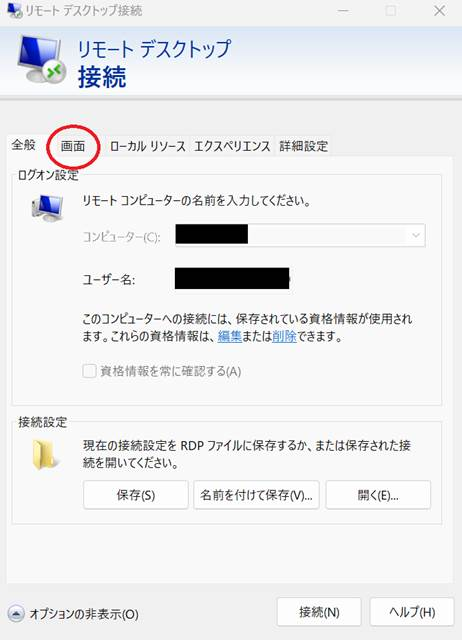
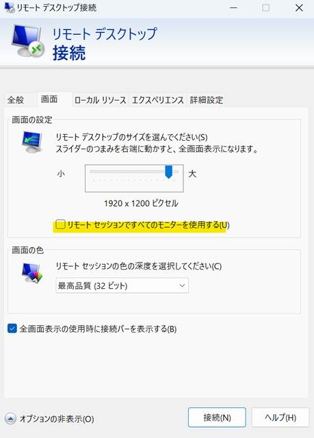

こんにちは。Azure テクニカル サポート チームの角村です。

今回は、Bastion 接続不可の際の原因の切り分け方法や原因ごとの対処法、よくあるお問い合わせについてご紹介します。
現在、Bastion に関するお問い合わせの約半分が接続不可に関するものですが、その原因は様々です。
トラブルシューティングの際には、原因の切り分けと、特定された原因に応じた対処方法を実施することで、問題が解消する可能性があります。</br>

実際に Bastion 経由で VM への接続ができない場合は、まず以下の点を確認してみてください。

<!-- more -->

## 特定の VM のみ/複数台の VM で発生している事象なのか
接続の問題が Bastion 側にあるのか、もしくは VM 側にあるのかを切り分けるための判断材料になります。
もしも特定の VM のみが接続不可となっている場合、主な原因として考えられる内容および対処方法は以下のとおりです。</br>

### **・VM および VM の サブネットに適用された NSG において、通信が許可されていない可能性**
Bastion - VM 間で RDP/SSH 通信が拒否されてしまっている場合、Bastion のサブネットから VM のサブネットへの SSH もしくは RDP (TCP ポート 22 もしくは TCP ポート 3389) の許可をするよう NSG の受信ルールを設定いただく必要がございます。</br>
NSG の設定例については以下の公式ブログでご紹介しておりますので、ご一読いただけますと幸いです。
[VM および VM のサブネットの NSG の受信セキュリティ規則](https://jpaztech.github.io/blog/network/bastion-nsg/#VM-%E3%81%8A%E3%82%88%E3%81%B3-VM-%E3%81%AE%E3%82%B5%E3%83%96%E3%83%8D%E3%83%83%E3%83%88%E3%81%AE-NSG-%E3%81%AE%E5%8F%97%E4%BF%A1%E3%82%BB%E3%82%AD%E3%83%A5%E3%83%AA%E3%83%86%E3%82%A3%E8%A6%8F%E5%89%87)

### **・接続情報に誤りがある可能性**
接続情報に関しては、作成の際に間違えて登録してしまうケースや、久しぶりに仮想マシンを利用する際の記憶違いや記録ミスなど、日常的に起こしやすいエラーの1つです。過去のお問合せでは、パスワード リセットによって事象が解消したケースもございます。
パスワード リセット方法については以下の公開情報にてご案内しておりますので参考になりましたら幸いです。
[Windows VM でリモート デスクトップ サービスまたはその管理者パスワードをリセットする - Virtual Machines | Microsoft Learn](https://learn.microsoft.com/ja-jp/troubleshoot/azure/virtual-machines/windows/reset-rdp)
[Azure VM 上でローカルの Linux パスワードをリセットする方法 - Virtual Machines | Microsoft Learn](https://learn.microsoft.com/ja-jp/troubleshoot/azure/virtual-machines/linux/reset-password)

複数台の VM において事象が発生している場合は、AzureBastionSubnet に関連付けられた NSG でパブリック インターネット、もしくはクライアントの グローバル IP アドレス範囲からの通信が許可されているかをご確認ください。
NSG の設定内容についての詳細は[こちら](https://learn.microsoft.com/ja-jp/azure/bastion/bastion-nsg#nsg)をご確認ください。

## 特定のクライアント端末でのみ発生している事象なのか
クライアント PC 側に要因があるかどうかを切り分けるための判断材料になります。
特定のクライアントのみ事象が発生している場合、さらに以下の点をご確認いただく事で事象が解消する可能性があります。</br>

### **・ブラウザ の拡張機能**
ブラウザの拡張機能が接続不可の要因となっている可能性があります。
可能であればブラウザの拡張機能を無効化の上、接続をお試しいただくか、InPrivate/シークレットモードを利用いただく事で事象が解消する可能性があります。
また、ブラウザによっては Bastion の利用がサポートされていない点についてもご注意ください。

参考- [どのブラウザーがサポートされていますか?](https://learn.microsoft.com/ja-jp/azure/bastion/bastion-faq#browsers)

### **・クライアント PCおよび、ネットワークの問題**
クライアント 側の のプロキシ設定や ファイヤーウォールが Bastion への接続をブロックしている可能性があります。
その場合、<*.bastion.azure.com> への 443 (https) を許可いただく事で、事象が解消する可能性があります。</br>
なお、Bastion はご利用方法によって URL が追加で必要になる場合があります。
例えば、ポータルから Bastion 経由で VM へ接続する場合は、上記 Bastion の URL 以外に、ポータルへの接続/操作のため、<*.portal.azure.com> の許可が現状の動作として必要です。

参考- [ファイアウォールまたはプロキシ サーバーで Azure portal の URL を許可する](https://learn.microsoft.com/ja-jp/azure/azure-portal/azure-portal-safelist-urls?tabs=public-cloud)

---
上記をご確認いただいても事象が解消しなかった場合や、該当する事象ではない場合は、Azure サポートまでお問い合わせください。
その際は、既にご確認いただいた内容と併せて、以下の点について情報提供いただけますと幸いです。</br>
---
>**・ 直近で接続不可となってしまった日時 (日本時間)**

Azure 基盤側で接続不可時のログを確認する際に必要な情報となります。

>**・ Bastion および接続不可 VM のリソース ID**

リソース ID は、リソース画面 左ブレード メニューの [概要] から 、画面右上の [JSON ビュー] をクリックいただくと確認可能でございます。
※お問合せ起票時に Bastion リソースを選択して起票いただいている場合は、接続不可 VM のリソース ID のみ、別途お問い合わせ内容に記載ください。

>**・ 接続エラー時のスクリーン ショット、もしくは接続実行コマンドと実行結果**

ブラウザ経由で接続に失敗する場合は、発生したエラーの内容がわかるスクリーン ショットをご提供ください。
Azure CLI から az network bastion コマンドを利用している場合は、 debug オプションを付けた状態で実行コマンドと実行結果をご教示いただけますと幸いです。
以下に実行いただきたいコマンドの例を記載いたします。
```
az network bastion rdp --name <Bastion リソース名> --resource-group <Bastion が存在するリソース グループ名> --target-resource-id <ターゲット VM のリソース ID> --debug
```
※ 上記は RDP 接続時のコマンドとなります。お客様の接続方法に合わせてコマンドを変更ください

>**・ Bastion を経由せずに VM へ直接 RDP/SSH が可能かどうか**

接続先 VM にパブリック IP が付与されている場合、クライアント PC からネイティブ クライアントを利用して直接 RDP/SSH 接続が可能かご確認ください。
もしくは、同一 Vnet 上の別 VM から 直接 RDP 接続が可能か確認いただくという方法でも問題ございません。</br>


## FAQ
その他、接続不可以外によくお問い合わせいただく内容についても以下にまとめてみましたので、参考になりましたら幸いです。

### Bastion インスタンスあたりのセッション数上限に達した際に検知したい
インスタンスあたりの同時接続数上限に達した際、それを検知してインスタンスをスケーリングさせたいというお問い合わせをいただく事がございます。
ご期待に沿えず恐れ入りますが、直接的にインスタンスあたりのセッション数の上限を検知する方法はありません。
そのため、例えばリモート接続で操作している VM の画面遷移が遅いなどの利用者からのフィード バックや、Bastion で監視可能なメトリックの情報を組み合わせて、お客様自身でインスタンスをスケールさせるタイミングをご判断いただく必要がございます。
なお、Bastion で監視可能なメトリックの一覧については[こちら](https://learn.microsoft.com/ja-jp/azure/bastion/howto-metrics-monitor-alert)をご確認ください。

また、以下の公開情報では Bastion インスタンスあたりの同時接続可能数について記載されていますが、あくまで目安の数値となります。実際のご利用方法によって、インスタンスあたりの接続数上限は前後する点についてもご留意ください。
参考- [Azure Bastion の制限](https://learn.microsoft.com/ja-jp/azure/azure-resource-manager/management/azure-subscription-service-limits#azure-bastion-limits)

### Bastion が対応している認証方法について
Bastion 接続時に利用可能な認証方法は、ご利用いただくプロトコルや SKU によって異なります。
ご利用環境と認証方式のミスマッチが起きているお問い合わせが散見されるため、以下のとおり表にまとめました。</br>

| プロトコル | 接続方法         | 認証方法                                                                       | 対応 SKU                    |
|------------|------------------|--------------------------------------------------------------------------------|-----------------------------|
| RDP　      | ブラウザ          | ・ユーザー/PW を手入力<br>・PW を Key Vault から読み込む                        | ・Developer<br>・Basic<br>・Standard<br>・Premium |
| RDP     　 | ネイティブ クライアント | ・ユーザー/PW を手入力<br>・Entra ID 認証                                       | ・Standard<br>・Premium       |
| RDP        | 共有可能リンク    | ・ユーザー/PW を手入力                                                           | ・Standard<br>・Premium       |
| SSH        | ブラウザ          | ・ユーザー/PW を手入力<br>・PW を Key Vault から読み込む<br>・SSH Key をローカルから読み込む<br>・SSH Key を Key Vault から読み込む | ・Developer<br>・Basic<br>・Standard<br>・Premium |
| SSH        | ネイティブ クライアント | ・ユーザー/PW を手入力<br>・Entra ID 認証<br>・SSH Key をローカルから読み込む       | ・Standard<br>・Premium       |
| SSH         | 共有可能リンク    | ・ユーザー/PW を手入力<br>・SSH Key をローカルから読み込む                         | ・Standard<br>・Premium       |


### Bastion 接続時の解像度を調節したい
ご期待に沿えず恐れ入りますが、ブラウザから Bastion を利用してリモート接続されている場合は、解像度を変更いただく事はできません。
ネイティブ クライアント接続をご利用されている場合は、以下の手順で解像度の調節が可能となります。</br>

1. ネイティブ クライアント接続コマンドの末尾に ”--configure” オプションを付けて実行</br>
実行コマンド例
```
az network bastion rdp --name <Bastion リソース名> --resource-group <Bastion が存在するリソース グループ名> --target-resource-id <ターゲット VM のリソース ID> --configure
```

2. コマンド実行後、リモート デスクトップ画面が開くので、[画面] タブをクリック</br>

 

</br>
  
3. 「画面の設定」にて、“リモート セッションですべてのモニターを使用する” のチェックをお外しいただき、
上部のスライダーを操作いただく事で解像度の設定が可能となります。</br>

 

以上、本情報が参考になれば幸いです。
