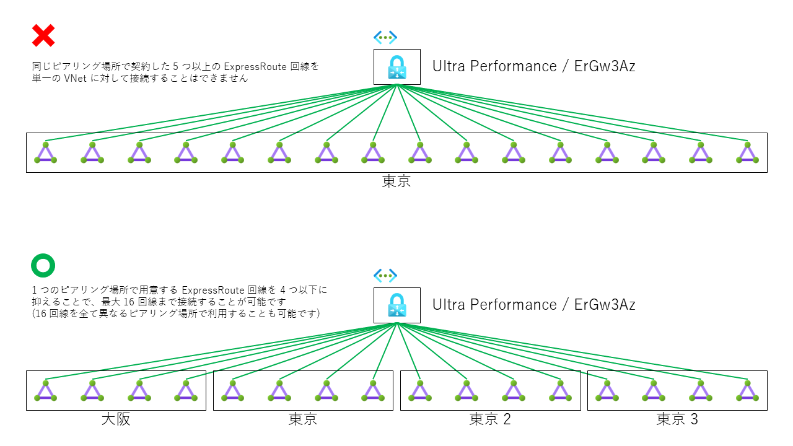
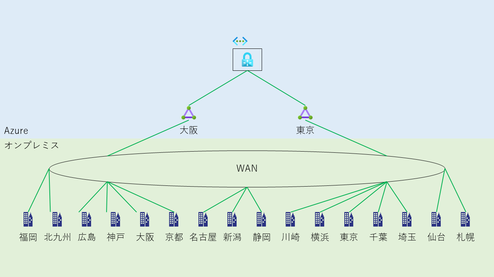
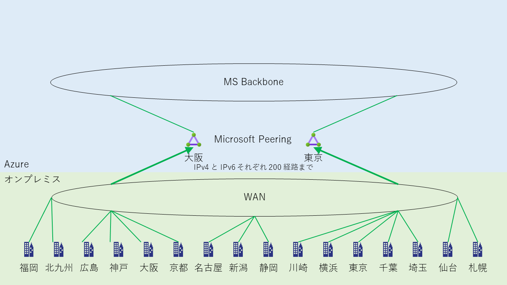

こんにちは。Azure サポートの宇田です。
今回は ExpressRoute 回線に関する各種上限値についてご紹介いたします。

* [Part1: ExpressRoute を導入する前に](./archive/expressroute-deep-dive-part1.md)
* [Part2: ExpressRoute のルーティング制御について](./archive/expressroute-deep-dive-part2.md)
* [Part3: ExpressRoute の導入手順について](./archive/expressroute-deep-dive-part3.md)
* [Part4: ExpressRoute の冗長構成について](./archive/expressroute-deep-dive-part4.md)
* [Part5: ExpressRoute の増速やプロバイダー変更について](./archive/expressroute-deep-dive-part5.md)
* Part6: ExpressRoute の各種上限値について

> [!NOTE]
> 以下でご紹介する各種上限値は、制限緩和などにより変更となっている場合があります。
> 本ブログの記載も可能な限り更新するように努めてはおりますが、**公式ドキュメントの最新の情報も併せてご参照ください。**

## 1 つの ExpressRoute 回線に対して接続できる VNet の数

1 つの ExpressRoute 回線に対して接続できる VNet (ExpressRoute Gateway) の数は、

* ExpressRoute 回線が **Local / Standard** の場合は、**10 VNetまで**
* ExpressRoute 回線が **Premium** の場合は、帯域幅に応じて **20 – 100 VNet まで**

となっています。(参考: [ExpressRoute の制限](https://learn.microsoft.com/ja-jp/azure/azure-resource-manager/management/azure-subscription-service-limits#expressroute-limits))

なお、上記の個数には直接接続している VNet (ExpressRoute Gateway) の数のみがカウントされますので、VNet Peering で Hub-Spoke 構成とした場合に、Spoke 側の VNet の数はカウントされません。したがって、大規模環境で多数の VNet を ExpressRoute 回線に接続したい場合には、Hub-Spoke 構成にすることで Standard SKU の ExpressRoute 回線であっても間接的に 10 個以上の VNet に対して接続することが可能になります。

## 1 つの VNet に対して接続できる ExpressRoute 回線の数

1 つの VNet (ExpressRoute Gateway) に対して接続できる ExpressRoute 回線の数は、

* **同一のピアリング場所** (Peering Location) では最大で **4 回線まで**
* **異なるピアリング場所** (Peering Location) であれば、
  * ExpressRoute Gateway が **Standard / ErGw1Az** の場合は、**4 回線まで**
  * ExpressRoute Gateway が **High Performance / ErGw2Az** の場合は、**8 回線まで**
  * ExpressRoute Gateway が **Ultra Performance / ErGw3Az** の場合は、**16 回線まで**
(多数の ExpressRoute 回線を接続する場合は GatewaySubnet が /27 では足りず、/26 必要になる場合があります)

となっています。(参考: [ExpressRoute の制限](https://learn.microsoft.com/ja-jp/azure/azure-resource-manager/management/azure-subscription-service-limits#expressroute-limits))

なお、ここでの “ピアリング場所” は東京、東京 2、東京 3、大阪といった ExpressRoute の接続拠点 (POP) を指します。東日本リージョンや西日本リージョンといった Azure のリージョンや、お客様の拠点の所在地のことではありませんので、混同されないようご注意ください。(参考: [地理的リージョン内の Azure リージョンと ExpressRoute の場所の対応](https://learn.microsoft.com/ja-jp/azure/expressroute/expressroute-locations-providers#locations))

各拠点や、各顧客ごとに個別の ExpressRoute 回線を用意して接続したいなど、何らかの理由で多数 (4 つ以上) の ExpressRoute 回線を同一の VNet に対して接続する場合には、ExpressRoute 回線を異なるピアリング場所でご用意いただく必要があります。

他方で、ExpressRoute 回線を個別に用意しなければならない特別なご事情が無い場合には、各拠点はキャリア様の WAN サービスなどを用いてオンプレミス側で一度集約していただき、Azure と接続するExpressRoute 回線は 1 つ (ないし少数) に集約いただく事もご検討ください。

## ExpressRoute 回線 (Private Peering) に対して広報できる経路数

Private Peering で ExpressRoute 回線に対して広報できる経路数は、

* ExpressRoute 回線が **Local / Standard** の場合は、**オンプレミス側からは IPv4: 4000 経路、IPv6: 100 経路まで**
* ExpressRoute 回線が **Premium** の場合は、**オンプレミス側からは IPv4: 10000 経路、IPv6: 100 経路まで**
* ExpressRoute 回線の **SKU に関わらず**、**各 VNet (ExpressRoute Gateway) 側からはそれぞれ IPv4: 1000 経路、IPv6: 100 経路まで**

となっています。(参考: [ルート アドバタイズの制限](https://learn.microsoft.com/ja-jp/azure/azure-resource-manager/management/azure-subscription-service-limits#route-advertisement-limits))

この経路数を超過した場合には、BGP の Neighbor が Down し、通信が行えなくなりますのでご注意ください。
(BGP Peer ごとに maximum-prefix が設定されているようなイメージです。)

## ExpressRoute 回線 (Microsoft Peering) に対して広報できる経路数

Microsoft Peering で ExpressRoute 回線に対して広報できる経路数は、

* ExpressRoute 回線の SKU を問わず、**IPv4: 200 経路、IPv6: 200 経路まで**

となっています。(参考: [ルート アドバタイズの制限](https://learn.microsoft.com/ja-jp/azure/azure-resource-manager/management/azure-subscription-service-limits#route-advertisement-limits))

Microsoft Peering の場合には、PE ルーターから広報する経路は NAT 等に利用する Public IP アドレスの経路となりますので、オンプレミス側の LAN で使用している Private IP の経路が広報されるわけではない点にご注意ください。

以上、ご参考になりましたら幸いです。
