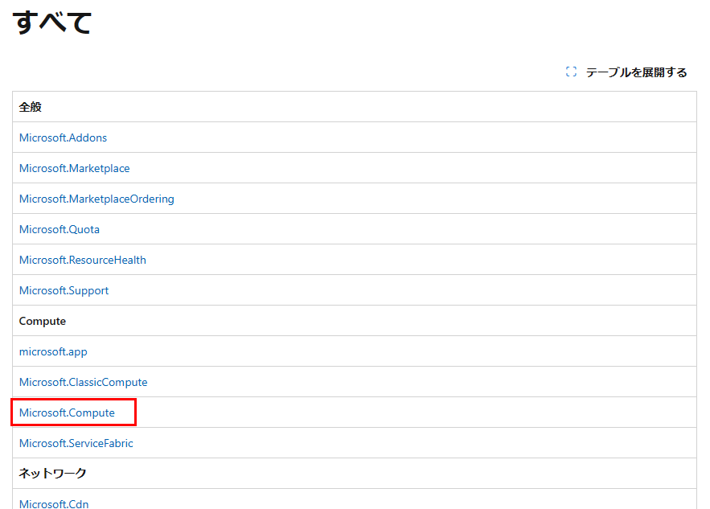
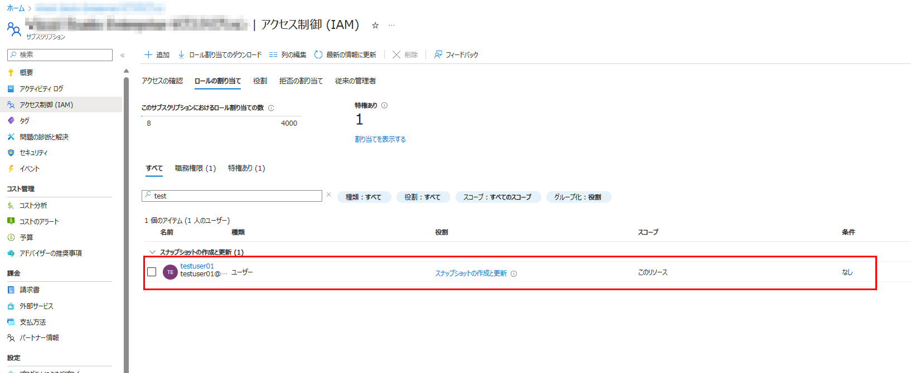
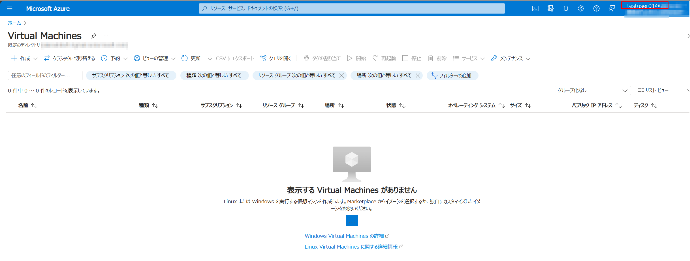
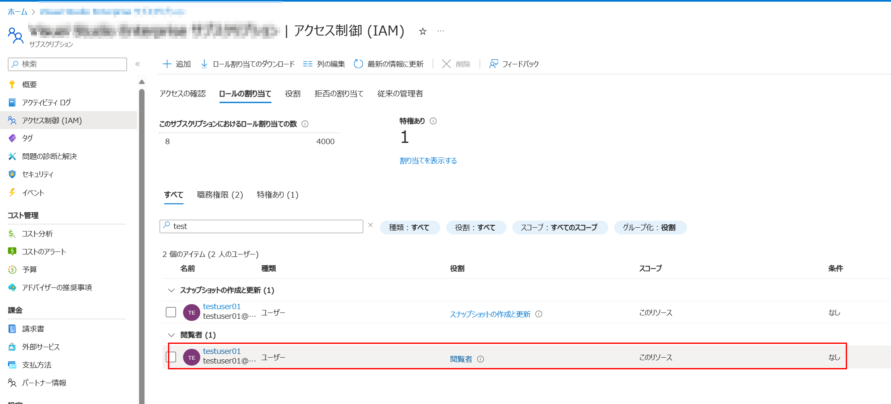
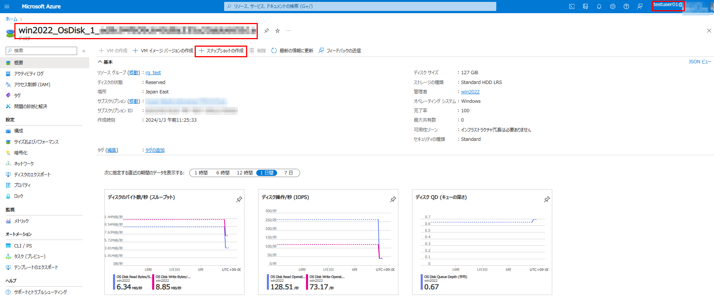
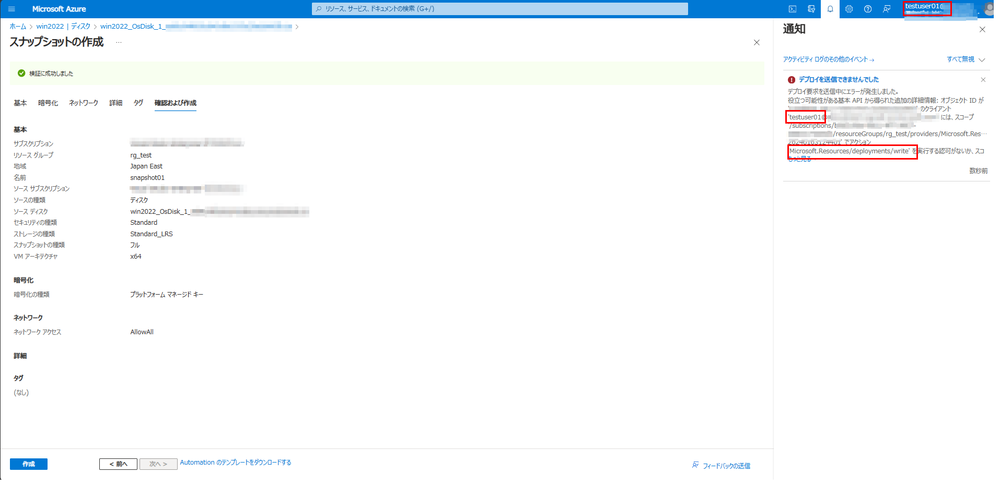
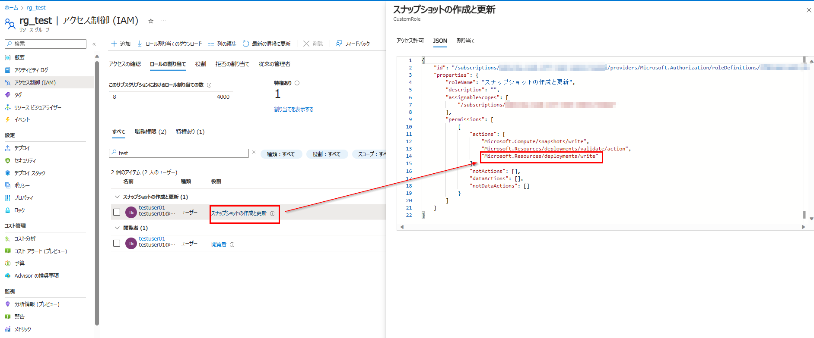
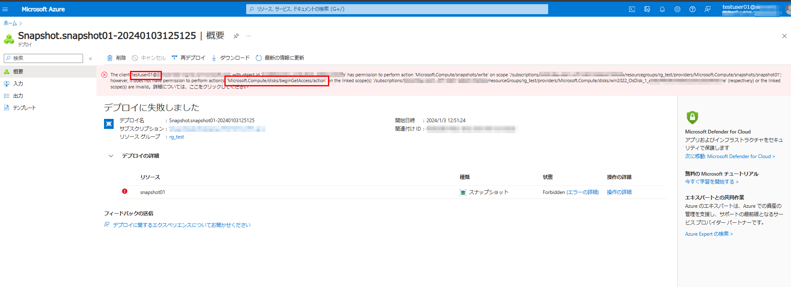
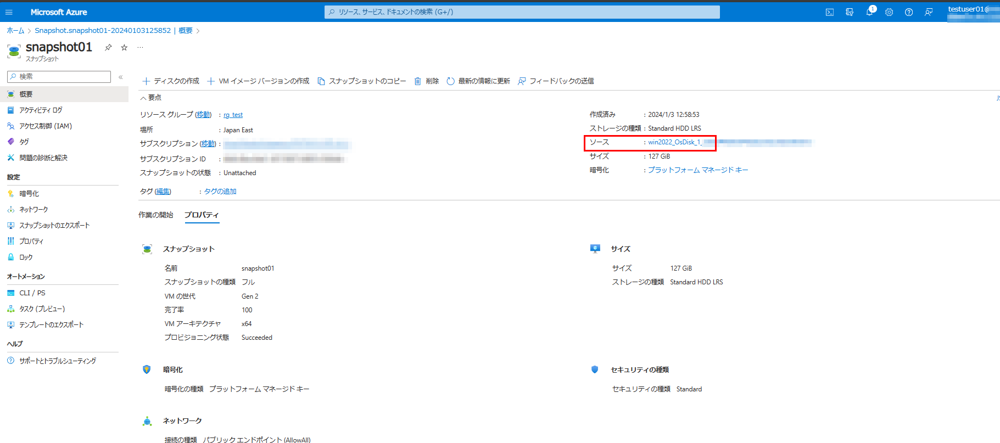
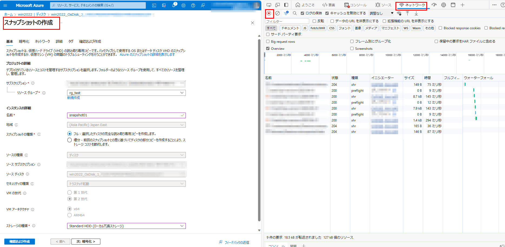

こんにちは、Azure テクニカル サポート チームの木下です。 
今回は特定の操作における Azure カスタム ロールの作成手順をご紹介いたします。 

- [1.Azure カスタム ロールについて](./#1azure-%E3%82%AB%E3%82%B9%E3%82%BF%E3%83%A0-%E3%83%AD%E3%83%BC%E3%83%AB%E3%81%AB%E3%81%A4%E3%81%84%E3%81%A6) 
- [2.カスタム ロールを作成する](./#2%E3%82%AB%E3%82%B9%E3%82%BF%E3%83%A0-%E3%83%AD%E3%83%BC%E3%83%AB%E3%82%92%E4%BD%9C%E6%88%90%E3%81%99%E3%82%8B) 
- [3.補足情報 - ブラウザー トレースにて必要となるリソース プロバイダー操作を把握する](./#3%E8%A3%9C%E8%B6%B3%E6%83%85%E5%A0%B1---%E3%83%96%E3%83%A9%E3%82%A6%E3%82%B6%E3%83%BC-%E3%83%88%E3%83%AC%E3%83%BC%E3%82%B9%E3%81%AB%E3%81%A6%E5%BF%85%E8%A6%81%E3%81%A8%E3%81%AA%E3%82%8B%E3%83%AA%E3%82%BD%E3%83%BC%E3%82%B9-%E3%83%97%E3%83%AD%E3%83%90%E3%82%A4%E3%83%80%E3%83%BC%E6%93%8D%E4%BD%9C%E3%82%92%E6%8A%8A%E6%8F%A1%E3%81%99%E3%82%8B) 
- [4.ご留意点](./#4-%E3%81%94%E7%95%99%E6%84%8F%E7%82%B9) 

## 1.Azure カスタム ロールについて 

Azure では、ロール ベース アクセス制御 (RBAC) という機能を使用し、アクセスできるリソースを制限したり、リソースへの操作を制限したりすることが可能です。 
Azure には既定で各リソース操作（アクション）の許可をまとめた組み込みロールのご用意がありますが、Azure 組み込みロールがお客様のご要件を満たさない場合は、独自の Azure カスタム ロールを作成することができます。 

参考）Azure 組み込みロール 
https://learn.microsoft.com/ja-jp/azure/role-based-access-control/built-in-roles 
> (抜粋) 
> Azure ロールベースのアクセス制御 (Azure RBAC) には、ユーザー、グループ、サービス プリンシパル、マネージド ID に割り当てることのできる Azure 組み込みロールがいくつかあります。 ロールの割り当ては、Azure リソースへのアクセスを制御する方法です。 組み込みロールが組織の特定のニーズを満たさない場合は、独自の Azure カスタム ロールを作成することができます。 ロールの割り当て方法については、「Azure ロールを割り当てる手順」を参照してください。 

上記のドキュメントにて各組み込みロールで、実際にどのアクションが許可されているのかも確認が可能です。 

ただし、リソースへの操作に対して最低限必要となるアクションの組み合わせについては、公開ドキュメントに明記されていないこともございますので、お客様のご要件に合わせてトライ アンド エラーしながら最終的に必要となるアクションを確認し、カスタム ロールを作成いただくこととなります。 
また、Azure サポート窓口にて、カスタム ロールの作成の代行は叶いません点あらかじめご了承ください。

## 2.カスタム ロールを作成する 

ここでは、Azure Portal から仮想マシンのディスクのスナップショットを取得するという操作を例に、当該操作を許可するためのアクションを確認し、カスタム ロールを作成していきます。 
なお、他のどのような操作におきましても必要最小限のアクションのみが許可されたカスタム ロールを作成いただく場合、基本的には以下例のようにトライ アンド エラーを繰り返しながらカスタム ロールを作成いただくこととなります。

### 手順 1.「Azure リソース プロバイダーの操作」より使用可能なアクセスアクションを検索し、カスタム ロールに含めるアクセスアクションを探します。 

Microsoft.Compute のリソース プロバイダーに対する操作となるため、Microsoft.Compute の項目を確認します。 

参考）Azure リソース プロバイダーの操作 
https://learn.microsoft.com/ja-jp/azure/role-based-access-control/resource-provider-operations 

スナップショットの作成には 'Microsoft.Compute/snapshots/write' のアクションが必要となることを確認します。 

必要となるアクションについては、既に権限のあるユーザーで実際の操作を行った際に記録されるアクティビティ ログの action 項目をご確認いただくことも有用です。 

 

### 手順 2.カスタム ロールを作成します。 

手順 1 で確認した 'Microsoft.Compute/snapshots/write' アクションのみを許可したカスタム ロールを作成します。 

[JSON] タブを選択すると  'Microsoft.Compute/snapshots/write' アクションのみが割り当たっていることを確認することができます。 

 

特定のユーザー testuser01 に当該カスタム ロールを割り当てます。 

カスタム ロールの作成手順の詳細については、以下のブログ記事や公開ドキュメントをご参照ください。 

参考）カスタムロールを作成する手順 
https://jpaztech.github.io/blog/vm/rbac-vm-start-stop-restart/#%E3%82%AB%E3%82%B9%E3%82%BF%E3%83%A0%E3%83%AD%E3%83%BC%E3%83%AB%E3%82%92%E4%BD%9C%E6%88%90%E3%81%99%E3%82%8B%E6%89%8B%E9%A0%86 
参考）Azure portal を使用して Azure カスタム ロールを作成または更新する
https://learn.microsoft.com/ja-jp/azure/role-based-access-control/custom-roles-portal
参考）カスタム ロールの作成手順 
https://learn.microsoft.com/ja-jp/azure/role-based-access-control/custom-roles 

### 手順 3.動作確認をします。 

ユーザー testuser01 で Azure Portal へサインインし、[Virtual Machines] の一覧ページへ遷移します。 
仮想マシンが表示されていません。 

これは、ユーザー testuser01 に対して [閲覧者] ロールが割り当てられていないためとなります。 

### 手順 4. 割り当てられているロールを修正します。 

リソースにアクセスできるよう ユーザー testuser01 に対して [閲覧者] ロールを割り当てます。 

 

仮想マシンの閲覧が可能となりました。 

### 手順 5.OS ディスクのスナップショットを作成します。 

OS ディスクのスナップショットを取得するため、対象となる OS ディスク名をクリックし、[+ スナップショットの作成] へ進みます。 

### 手順 6. 動作確認を行いながら、トライ アンド エラーを繰り返します。 

スナップショット作成のための必要事項を編集し、作成を行うと以下のエラーが出力されました。 

>{"code":"AuthorizationFailed","message":"オブジェクト ID が 'XXX' のクライアント 'testuser01@XXX' には、スコープ '/subscriptions/XXXXXX/resourceGroups/rg_test/providers/Microsoft.Resources/deployments/Snapshot.snapshot01-20240103123034' でアクション 'Microsoft.Resources/deployments/validate/action' を実行する認可がないか、スコープが無効です。アクセスが最近許可された場合は、資格情報を更新してください。"} 

リソースのデプロイ検証に必要なアクションが不足していることが分かります。 

参考）Microsoft.Resources 
https://learn.microsoft.com/ja-jp/azure/role-based-access-control/resource-provider-operations#microsoftresources

| アクション | 説明 | 
| Microsoft.Resources/deployments/validate/action | デプロイを検証します。 | 

手順 2 で作成したカスタム ロールに 'Microsoft.Resources/deployments/validate/action' アクションを追加します。 

次は別のエラーが出力されました。 

>デプロイ要求を送信中にエラーが発生しました。 
役立つ可能性がある基本 API から得られた追加の詳細情報: オブジェクト ID が 'XXX' のクライアント 'testuser01@XXX' には、スコープ '/subscriptions/XXXXX/resourceGroups/rg_test/providers/Microsoft.Resources/deployments/Snapshot.snapshot01-20240103124401' でアクション 'Microsoft.Resources/deployments/write' を実行する認可がないか、スコープが無効です。アクセスが最近許可された場合は、資格情報を更新してください。 

デプロイの作成に必要となるアクションが不足していることが分かります。 

参考）Microsoft.Resources 
https://learn.microsoft.com/ja-jp/azure/role-based-access-control/resource-provider-operations#microsoftresources

| アクション | 説明 | 
| Microsoft.Resources/deployments/write | デプロイを作成または更新します。 | 

手順 2 で作成したカスタム ロールに 'Microsoft.Resources/deployments/write' アクションを追加します。 

今度は、'Microsoft.Compute/disks/beginGetAccess/action' アクションが不足しているというエラーが出力されました。 

>The client 'testuser01@XXX' with object id 'XXX' has permission to perform action 'Microsoft.Compute/snapshots/write' on scope '/subscriptions/XXXXX/resourcegroups/rg_test/providers/Microsoft.Compute/snapshots/snapshot01'; however, it does not have permission to perform action(s) 'Microsoft.Compute/disks/beginGetAccess/action' on the linked scope(s) '/subscriptions/XXXXX/resourceGroups/rg_test/providers/Microsoft.Compute/disks/win2022_OsDisk_1_XXX (respectively) or the linked scope(s) are invalid。詳細については、ここをクリックしてください 

参考）Microsoft.Compute 
https://learn.microsoft.com/ja-jp/azure/role-based-access-control/resource-provider-operations#microsoftcompute

| アクション | 説明 | 
| Microsoft.Compute/disks/beginGetAccess/action | BLOB へのアクセス用にディスクの SAS URI を取得します。 | 

手順 2 で作成したカスタム ロールに "Microsoft.Compute/disks/beginGetAccess/action" を追加します。 

ついに、スナップショットの作成に成功しました。 

最終的にユーザー testuser01 に対して必要となったアクションは以下となります。 

| アクション | 説明 | 
| */read | 「閲覧者」ロール | 
| Microsoft.Compute/snapshots/write | 新しいスナップショットを作成するか、既存のスナップショットを更新します。 |  
| Microsoft.Resources/deployments/validate/action | デプロイを検証します。 | 
| Microsoft.Resources/deployments/write | デプロイを作成または更新します。 | 
| Microsoft.Compute/disks/beginGetAccess/action | BLOB へのアクセス用にディスクの SAS URI を取得します。 | 

以上のような手順にて、トライ アンド エラーを繰り返しながら、お客様環境にて必要最小となるアクションのみを付与したロールを作成いただく形となります。 

## 3.補足情報 - ブラウザー トレースにて必要となるリソース プロバイダー操作を把握する 

トライ アンド エラーにてカスタム ロールを作成いただく際の補足情報となりますが、ブラウザー トレース (HAR トレース、F12 トレース) をご活用いただくことで、特定の操作を行う際に必要となるリソース プロバイダー操作をある程度把握することも可能です。 

### 手順 1. ブラウザー トレース (HAR トレース、F12 トレース) を取得します。 

既に権限を持っているユーザーにてスナップショットを作成する際に、ブラウザー トレースを取得します。 

 

ブラウザー トレース (HAR トレース、F12 トレース) の取得手順の詳細は以下をご参照ください。 

参考）ネットワーク トレースの収集方法 
https://learn.microsoft.com/ja-jp/azure/azure-web-pubsub/howto-troubleshoot-network-trace 

### 手順 2. 取得したブラウザー トレースを確認します。 

手順 1 にて生成された portal.azure.com.har という .har ファイルを開き、スナップショットを作成する際に必要となったリソース プロバイダー操作 (providers) を確認します。 

 
以下 3 つに関するリソース プロバイダー操作が必要となることが分かります。 

Microsoft.Resources/deployments 
Microsoft.Compute/snapshots 
Microsoft.Compute/disks 

さらに細かなアクションまでを把握することは叶いませんが、カスタム ロールを作成いただく際にどのリソース プロバイダー操作が必要となるかをある程度把握することができます。 

### 4. ご留意点 

・Azure RBAC のスコープについて 
Azure RBAC の付与は、管理グループ、サブスクリプション、リソース グループ、リソースいずれかのスコープに対して適用することが可能となります。 
今回、サブスクリプションをスコープとしたカスタム ロールを割り当てたため、サブスクリプション内に存在する全ての仮想マシンに対して同様の操作が実施可能になります。 

特定の複数の仮想マシンに対してロールを付与をしたい場合には、対象の仮想マシンが所属するリソース グループや仮想マシンひとつひとつに対して付与を行っていただくことが可能になります。 
（親スコープに設定されたロールは、子スコープに継承されます） 

参考）Azure RBAC のスコープについて 
https://docs.microsoft.com/ja-jp/azure/role-based-access-control/scope-overview 

・リソース操作を行うツールについて 

Azure Portal や Azure PowerShell、Azure CLI 等のツールからリソースを操作することが可能ですが、操作を行うツールによって必要となるアクションが異なるケースがございます。このような場合は、リソース操作を行うツールにて検証を行い、必要となるアクションを取捨選択いただきますようお願い申し上げます。 
