こんにちは、Azure テクニカル サポート チームの富田です。  
Azure 上で稼働する Windows VM のライセンス認証のためにマイクロソフトが KMS サーバー（KMS ホスト サーバー）を提供しております。
KMS サーバーへのライセンス認証要求は KMS クライアント (Windows VM) から KMS サーバーに対して定期的かつ自動的に実行されます。  
Azure Windows VM から Azure の KMS サーバーに対して適切な経路で通信が行えない環境等においては、KMS のライセンス認証が失敗し続け、ライセンス認証切れに関する警告が表示されることがございます。  
本件について多くのお問い合わせをいただきますため、KMS のライセンス認証のトラブルシューティング等について以下の内容をご紹介させていただきます。

- [KMS ライセンス認証についての解説](./#KMS-%E3%83%A9%E3%82%A4%E3%82%BB%E3%83%B3%E3%82%B9%E8%AA%8D%E8%A8%BC%E3%81%AB%E3%81%A4%E3%81%84%E3%81%A6%E3%81%AE%E8%A7%A3%E8%AA%AC)
  - [KMS ライセンス認証の概要](./#KMS-%E3%83%A9%E3%82%A4%E3%82%BB%E3%83%B3%E3%82%B9%E8%AA%8D%E8%A8%BC%E3%81%AE%E6%A6%82%E8%A6%81)
  - [KMS ライセンス認証に必要な設定および通信要件](./#KMS-%E3%83%A9%E3%82%A4%E3%82%BB%E3%83%B3%E3%82%B9%E8%AA%8D%E8%A8%BC%E3%81%AB%E5%BF%85%E8%A6%81%E3%81%AA%E8%A8%AD%E5%AE%9A%E3%81%8A%E3%82%88%E3%81%B3%E9%80%9A%E4%BF%A1%E8%A6%81%E4%BB%B6)
  - [自動的なライセンス認証および有効期限について](./#%E8%87%AA%E5%8B%95%E7%9A%84%E3%81%AA%E3%83%A9%E3%82%A4%E3%82%BB%E3%83%B3%E3%82%B9%E8%AA%8D%E8%A8%BC%E3%81%8A%E3%82%88%E3%81%B3%E6%9C%89%E5%8A%B9%E6%9C%9F%E9%99%90%E3%81%AB%E3%81%A4%E3%81%84%E3%81%A6)
  - [ライセンス認証切れの影響](./#%E3%83%A9%E3%82%A4%E3%82%BB%E3%83%B3%E3%82%B9%E8%AA%8D%E8%A8%BC%E5%88%87%E3%82%8C%E3%81%AE%E5%BD%B1%E9%9F%BF)

- [トラブルシューティング方法](./#%E3%83%88%E3%83%A9%E3%83%96%E3%83%AB%E3%82%B7%E3%83%A5%E3%83%BC%E3%83%86%E3%82%A3%E3%83%B3%E3%82%B0%E6%96%B9%E6%B3%95)
  - [手動ライセンス認証のコマンド実行](./#%E6%89%8B%E5%8B%95%E3%83%A9%E3%82%A4%E3%82%BB%E3%83%B3%E3%82%B9%E8%AA%8D%E8%A8%BC%E3%81%AE%E3%82%B3%E3%83%9E%E3%83%B3%E3%83%89%E5%AE%9F%E8%A1%8C)
  - [ライセンス状態および設定確認](./#%E3%83%A9%E3%82%A4%E3%82%BB%E3%83%B3%E3%82%B9%E7%8A%B6%E6%85%8B%E3%81%8A%E3%82%88%E3%81%B3%E8%A8%AD%E5%AE%9A%E7%A2%BA%E8%AA%8D)
  - [KMS サーバーへの名前解決および疎通確認コマンドの実行](./#KMS-%E3%82%B5%E3%83%BC%E3%83%90%E3%83%BC%E3%81%B8%E3%81%AE%E5%90%8D%E5%89%8D%E8%A7%A3%E6%B1%BA%E3%81%8A%E3%82%88%E3%81%B3%E7%96%8E%E9%80%9A%E7%A2%BA%E8%AA%8D%E3%82%B3%E3%83%9E%E3%83%B3%E3%83%89%E3%81%AE%E5%AE%9F%E8%A1%8C)
  - [イベントログでライセンスログを見る](./#%E3%82%A4%E3%83%99%E3%83%B3%E3%83%88%E3%83%AD%E3%82%B0%E3%81%A7%E3%83%A9%E3%82%A4%E3%82%BB%E3%83%B3%E3%82%B9%E3%83%AD%E3%82%B0%E3%82%92%E8%A6%8B%E3%82%8B)

- [よくあるトラブルのパターン](./#%E3%82%88%E3%81%8F%E3%81%82%E3%82%8B%E3%83%88%E3%83%A9%E3%83%96%E3%83%AB%E3%81%AE%E3%83%91%E3%82%BF%E3%83%BC%E3%83%B3)
  - [KMS サーバーの一時的な負荷](./#KMS-%E3%82%B5%E3%83%BC%E3%83%90%E3%83%BC%E3%81%AE%E4%B8%80%E6%99%82%E7%9A%84%E3%81%AA%E8%B2%A0%E8%8D%B7)
  - [ファイアウォール製品で通信をブロックしている](./#%E3%83%95%E3%82%A1%E3%82%A4%E3%82%A2%E3%82%A6%E3%82%A9%E3%83%BC%E3%83%AB%E8%A3%BD%E5%93%81%E3%81%A7%E9%80%9A%E4%BF%A1%E3%82%92%E3%83%96%E3%83%AD%E3%83%83%E3%82%AF%E3%81%97%E3%81%A6%E3%81%84%E3%82%8B)
  - [強制トンネリング環境（オンプレミス等を経由し直接通信となっていない）](./#%E5%BC%B7%E5%88%B6%E3%83%88%E3%83%B3%E3%83%8D%E3%83%AA%E3%83%B3%E3%82%B0%E7%92%B0%E5%A2%83%EF%BC%88%E3%82%AA%E3%83%B3%E3%83%97%E3%83%AC%E3%83%9F%E3%82%B9%E7%AD%89%E3%82%92%E7%B5%8C%E7%94%B1%E3%81%97%E7%9B%B4%E6%8E%A5%E9%80%9A%E4%BF%A1%E3%81%A8%E3%81%AA%E3%81%A3%E3%81%A6%E3%81%84%E3%81%AA%E3%81%84%EF%BC%89)
  - [Standard SKU の Azure Load Balancer 配下の VM で外部接続ができない](./#Standard-SKU-%E3%81%AE-Azure-Load-Balancer-%E9%85%8D%E4%B8%8B%E3%81%AE-VM-%E3%81%A7%E5%A4%96%E9%83%A8%E6%8E%A5%E7%B6%9A%E3%81%8C%E3%81%A7%E3%81%8D%E3%81%AA%E3%81%84)
  - [Tokens.dat ファイルの破損](./#Tokens-dat-%E3%83%95%E3%82%A1%E3%82%A4%E3%83%AB%E3%81%AE%E7%A0%B4%E6%90%8D)
  
- [さいごに（その他の要因等について）](./#%E3%81%95%E3%81%84%E3%81%94%E3%81%AB%EF%BC%88%E3%81%9D%E3%81%AE%E4%BB%96%E3%81%AE%E8%A6%81%E5%9B%A0%E7%AD%89%E3%81%AB%E3%81%A4%E3%81%84%E3%81%A6%EF%BC%89)

---
## KMS ライセンス認証についての解説

先述の通り、Azure 上の Windows VM は定期的かつ自動的に KMS ライセンス認証が行われます。  
KMS ライセンス認証についてどのように行われるのかといった概要などをご紹介させていただきます。  

---
### KMS ライセンス認証の概要

Azure 上で稼働する Windows VM は従量課金制となっており、原則稼働時の従量課金にライセンス料が含まれております。  
ゲスト OS となる Windows からは KMS（Key Management Services）サーバーに、定期的なライセンス認証が行われます。  
このライセンス認証先の KMS サーバーは Azure 上にマイクロソフトがご用意しております。  
そのため、お客様のご利用の Windows VM から KMS サーバーへのライセンス認証の通信経路が確保されている必要がございます。

> [!TIP]
> Azure 上にお客様ご自身で KMS ホストサーバーの役割を担う KMS ホストを構築いただく場合は、そのサーバーではオンプレミス環境と同様に KMS ホストサーバー用の MAK キー（KMS ホスト キー）を使用してライセンス認証を実施する手順が必要となります。  

---
### KMS ライセンス認証に必要な設定および通信要件

Azure VM から KMS サーバーへの通信は、**TCP 宛先ポート 1688** で以下のドメインに対して行われます。

> **kms.core.windows.net** もしくは **azkms.core.windows.net**

このドメインは以下の IP アドレスのいずれかに名前解決されます。

> **20.118.99.224, 40.83.235.53, 23.102.135.246**

なお、KMS ライセンスサーバー自体は Azure 上にご用意をしておりますが、上記の通りグローバル IP アドレスで名前解決されますので、VM からは Internet 方向としてルーティングされる必要がございます。  

重要な点として、原則 VM から直接 KMS サーバーへの通信を行っていただく必要がございます。  
オンプレミス環境を経由したライセンス認証の通信ではライセンス認証が失敗することがございます。  
この点については後述の「強制トンネリング環境（直接通信となっていない）」をご参照ください。
下図は KMS ライセンス認証の成功・失敗の例を表した図となります。

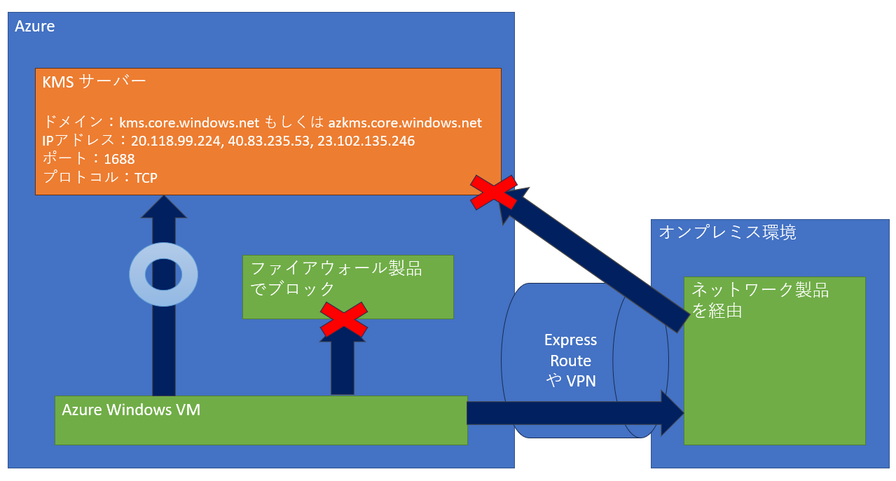

> [!TIP]
> KMS ライセンスサーバーへのライセンス認証通信については、NSG（ネットワークセキュリティグループ）の影響を受けないよう暗黙的なルールが存在します。  
> 例外的にサブネットに対して 0.0.0.0/0 のルールがある場合は、暗黙的なルールがスキップされ、明示的に許可ルールが必要となります。  

また、OS 毎に KMS 専用のプロダクトキーの設定が必要です。  
Azure マーケットプレイスからデプロイした VM 等では既定でこのプロダクトキーが設定されており、対応は不要でございますが、以下のシナリオに該当する場合は手動でライセンスキーの入力が必要となります。

- コンピューターをマルチ ライセンス認証キー (MAK) の使用から KMS クライアントに変換する
- Windows の製品版 (OEM/Retail) ライセンスを KMS クライアントに変換する
- コンピューターが以前に KMS ホストであった場合 KMS クライアントに変換する

■ご参考：キー管理サービス (KMS) クライアントのライセンス認証とプロダクト キー
https://learn.microsoft.com/ja-jp/windows-server/get-started/kms-client-activation-keys

---
### 自動的なライセンス認証および有効期限について

ライセンス認証は既定では以下の間隔で自動的に認証されます。  

- ライセンス認証がされていない状態：2 時間に 1 回の頻度
- ライセンス認証がされている状態：7 日に 1 回の頻度

また、ライセンス認証は毎回必ず成功する必要はなく、一度認証されれば 180 日の有効期限が付与されます。 
認証に成功する度に有効期限が再び 180 日からカウントされます。  

つまり、正常な状況であれば定期的なライセンス認証によって、180 日の有効期限が毎回更新されるという形となります。

---
### ライセンス認証切れの影響

Windows 8 / Windows Server 2012 以降の OS の場合のライセンス認証の影響について記載させていただきます。  
上記期間内にライセンス認証が成功しない場合は、通知モード（ライセンス認証切れ状態）となります。  
この際の影響は以下のようなものとなります。  

1. 画面の右下にライセンス認証が必要であることを示すウォーターマーク（透かし文字） が表示されます。
1. 壁紙の右下に OS の情報を示す文字が表示されます。（Windows 8 / Windows Server 2012 及び 2012 R2 のみ）
1. パーソナル設定内の項目は設定変更不可となります。
1. 自身が KMS ホストの場合、KMS クライアントの認証が行えません。

Azure VM の場合以下に記載の影響もございます。  

■ご参考：Azure Windows 仮想マシンのアクティブ化に関する FAQ
https://learn.microsoft.com/ja-jp/troubleshoot/azure/virtual-machines/windows/windows-virtual-machine-activation-faq

> **Windows マシンがアクティブ化されていない場合、メモリは 2 GB に制限されますか?**   
> はい。使用可能なすべてのメモリにアクセスするには、Windows マシンをアクティブにする必要があります。

---
## トラブルシューティング方法

ライセンス有効期限が近づくと、以下のようなライセンス認証を促すメッセージなどが表示されることがございます。  

![Windows のライセンスの有効期限がもうすぐ切れます [設定] で Windows のライセンス認証を行う必要があります](./kms-troubleshooting/2023-08-02-11-38-39.png)

また、ライセンス認証が切れた際にメッセージが表示されるものと存じます。


この場合は、何からの理由で自動的なライセンス認証が繰り返し失敗しており、ライセンス認証がまもなく切れる / 切れてしまっているといった状況が考えられます。 

よくあるライセンス認証の失敗のエラーコードとして「0xC004F074」や「0x8007139F」が表示されることがございます。  
エラーコードから一発で原因究明ができるのが望ましいですが、恐縮ながら KMS ライセンス認証のトラブルシューティングは 1 つずつ原因切り分け等を行う必要がございます。  
そのため、まずは先述の必要な通信要件等が可能な状況かご確認いただくことが必要です。  
以下に正常なライセンス認証を行うためのトラブルシューティング方法を解説させていただきます。  

■ご参考：Azure Windows 仮想マシンのライセンス認証に関する問題のトラブルシューティング
https://learn.microsoft.com/ja-jp/troubleshoot/azure/virtual-machines/troubleshoot-activation-problems

---
### 手動ライセンス認証のコマンド実行

まずは、手動でのライセンス認証コマンドを実行し、ライセンス認証が正常に成功するかご確認頂くのが良いかと存じます。  
別途設定などの修正等を行った後にライセンス認証が成功するか確認する際にもこちらのコマンドをご利用いただけます。  
管理者特権の Windows PowerShell プロンプトにて以下のコマンドの実行をお願いいたします。

```powershell
1..12 | ForEach-Object { Invoke-Expression "$env:windir\system32\cscript.exe $env:windir\system32\slmgr.vbs /ato" ; start-sleep 5 }
```

こちらのコマンドは、KMS サーバーに対しライセンス認証を 5 秒毎に 12 回実行するコマンドとなっております。  
1 回のみの実行の場合、一時的な問題で失敗することがございますため複数回の実行としております。  
成功した場合は以下のようなメッセージが表示されます。  

> Windows(R)、ServerDatacenter エディションのアクティブ化 (12345678-1234-1234-1234-1234-12345678) ... 製品が正常にアクティブ化されました。

---
### ライセンス状態および設定確認

ライセンス状態および設定確認を行うには PowerShell で以下のコマンドを実行します。  

```powershell
cscript c:\windows\system32\slmgr.vbs /dlv
```

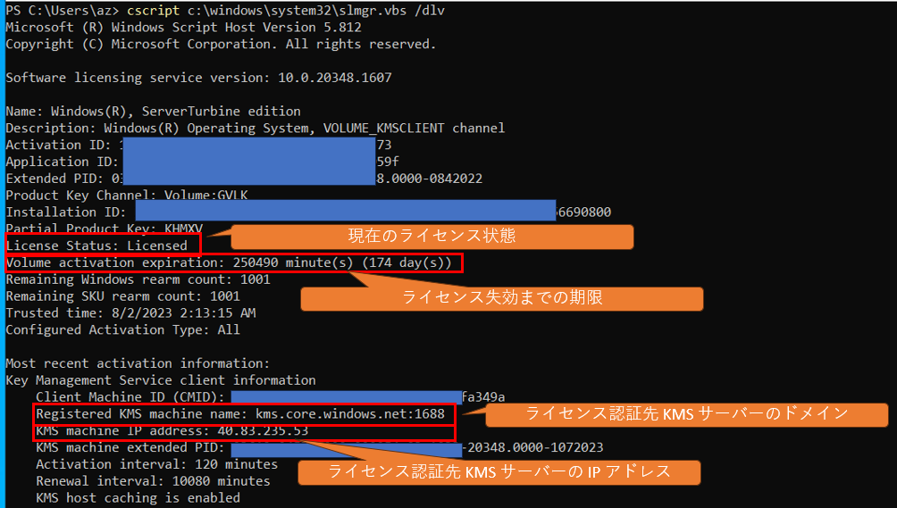

上記のように、ライセンスの状態やライセンス認証先の情報の確認が可能でございます。  
  
なお、ライセンスの有効期限が切れた状態などでは上記コマンドでライセンス認証先 KMS サーバーの情報が表示されないことがございます。  
そのような場合は以下のいずれか方法でライセンス認証先 KMS サーバーの情報を確認することが可能です。  
- **Event Viewer (Local) > Windows Logs > Application** アプリケーションイベントログのイベント ID 12288 でライセンス認証先を確認する。
- 以下のコマンドを実行する。

```powershell
# dummy
# 設定されているライセンス認証先 KMS サーバーのドメインを確認
reg query "HKEY_LOCAL_MACHINE\SOFTWARE\Microsoft\Windows NT\CurrentVersion\SoftwareProtectionPlatform" /v KeyManagementServiceName

# 設定されているライセンス認証先 KMS サーバーのポート番号を確認
reg query "HKEY_LOCAL_MACHINE\SOFTWARE\Microsoft\Windows NT\CurrentVersion\SoftwareProtectionPlatform" /v KeyManagementServicePort
```

もしライセンス認証先 KMS サーバーを IP アドレスを固定で指定してしまっている場合など、KMS ライセンス認証先の修正が必要な場合は以下のコマンドで修正可能です。  
なお、修正後に設定を反映させるために先述の手動のライセンス認証のコマンド実行も合わせてお願いいたします。  

```powershell
cscript c:\windows\system32\slmgr.vbs /skms azkms.core.windows.net:1688
```

---
### KMS サーバーへの名前解決および疎通確認コマンドの実行

KMS ライセンス認証が失敗している原因として、名前解決ができていないといった事や、疎通が失敗している可能性がございます。  
この点の原因切り分けのためには以下の PowerShell コマンドを実行します。

- DNS での名前解決の確認

```powershell
# 古い情報での名前解決を抑止するため DNS キャッシュをクリア
ipconfig /flushdns

# KMS サーバーの名前解決が可能か確認する
nslookup kms.core.windows.net
nslookup azkms.core.windows.net
```

成功した場合は、以下のように KMS サーバーの IP アドレスが名前解決されます。

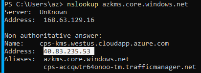

名前解決ができていない場合は、DNS サーバーの設定の見直しやポート 53 UDP での DNS の通信ができているかといった点を確認する必要がございます。

- KMS サーバーへのポート 1688 での疎通確認

```powershell
Test-NetConnection -ComputerName kms.core.windows.net -Port 1688
Test-NetConnection -ComputerName azkms.core.windows.net -Port 1688
```

成功した場合は、以下のような **TcpTestSucceeded : True** の結果が表示されます。


こちらの通信が成功しない場合は、OS 内部や経由しているファイアウォールでの通信がブロックされている等の原因が考えられますため、後述のトラブルシューティングなどでこの通信を成功させるように修正が必要です。

---
### イベントログでライセンスログを見る

ライセンス認証の成功・失敗については Windows OS 内の Event Viewer を用いて、  
 **Event Viewer (Local) > Windows Logs > Application**  
よりアプリケーションイベントログよりご確認いただくことが可能でございます。  
以下にトラブルシューティングで使われるイベント ID をご紹介させていただきます。

- 12288：KMS クライアントから KMS サーバーに認証を要求した際のログ

イベント ID 12288 は KMS クライアントが KMS サーバーに対してライセンス認証を要求した際のログとなります。  
後述の「12289：ライセンス認証の結果表示」と対になるログでございますので、「12288：ライセンス認証開始」はあるが「12289：ライセンス認証の結果表示」が無いといった場合は、以下のいずれかの状況を意味します。  

1. KMS クライアントが KMS サーバーに接続できなかったこと
1. KMS サーバーが応答しなかったこと
1. KMS クライアントが KMS サーバーからの応答を受信しなかったこと

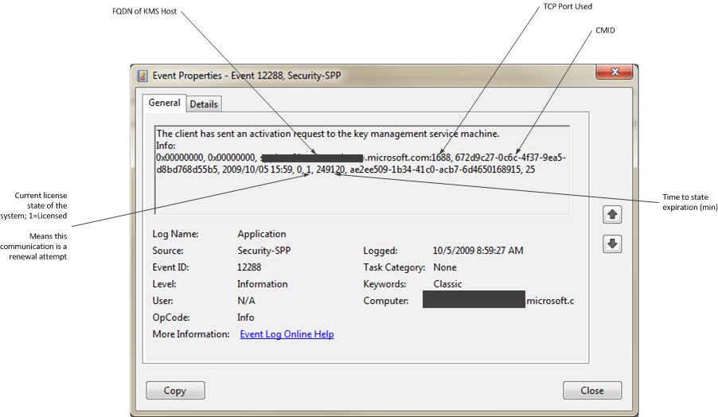

- 12289：ライセンス認証の結果表示

イベント ID 12289 は KMS ライセンス認証の結果を表示します。  
以下の図の通り Info に表示されている 3 個目のフラグが「1」の場合はライセンス認証成功です。  
「0」となっとる場合はライセンス認証失敗となります。

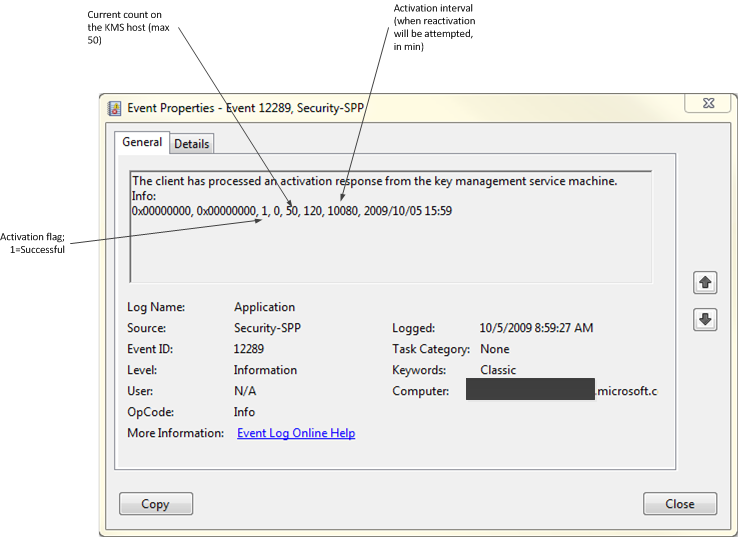

■ご参考：便利な KMS クライアント イベント  
https://learn.microsoft.com/ja-jp/windows-server/get-started/activation-troubleshoot-kms-general#useful-kms-client-events

- 8198, 8200：ライセンス認証の失敗

イベント ID 8198, 8200 は KMS ライセンス認証の失敗時に表示されることのあるログとなります。  

後述の[「KMS サーバーの一時的な負荷」](./#KMS-%E3%82%B5%E3%83%BC%E3%83%90%E3%83%BC%E3%81%AE%E4%B8%80%E6%99%82%E7%9A%84%E3%81%AA%E8%B2%A0%E8%8D%B7)のセクションに記載の通り、一時的な KMS サーバーの負荷の問題で表示される可能性がございますが、「12289：ライセンス認証の結果表示」にて正常にライセンス認証がされている場合は無視可能となります。  
そのため、「8198, 8200：ライセンス認証の失敗」は常に発生しておらず単発的な場合は、無視いただいて問題ございません。

---
## よくあるトラブルのパターン

お客様から「ライセンス認証が失敗する」といった場合に、よくあるトラブルのパターンおよびその対処方法についてご案内をさせていただきます。  

---
### KMS サーバーの一時的な負荷

Azure のKMS サーバーは全世界の Azure 上の Windows OS を認証している関係で、稀に負荷が集中するといったタイミングで応答ができない場合がございます。  
一般的には、エラーイベントが数日に１回、といった頻度で記録されるに留まりますが、場合によっては丸 1 日継続するようなケースもあります。  
Azure データセンターでも、随時 KMS の補強作業を行っていますが、常時 100 ％成功を目指しているものではございません。  
この理由としては、先述の通り Windows のライセンス認証はその後リトライされ、ライセンス失効期間内で毎回失敗し続けなければライセンスが失効することはありません。  
つまりライセンス認証失敗のエラーイベントが恒常的にではなく、一時的に記録されるだけである場合、無視可能です。  

他方、一時的ではなく常に毎回ライセンス認証失敗が失敗している場合は別の原因があるものと考えられますため、別途トラブルシューティングが必要でございます。

---
### ファイアウォール製品で通信をブロックしている

KMS の通信が Azure Firewall 等のファイアウォール製品を経由している場合、このファイアウォールでライセンス認証の通信がブロックされている可能性がございます。  

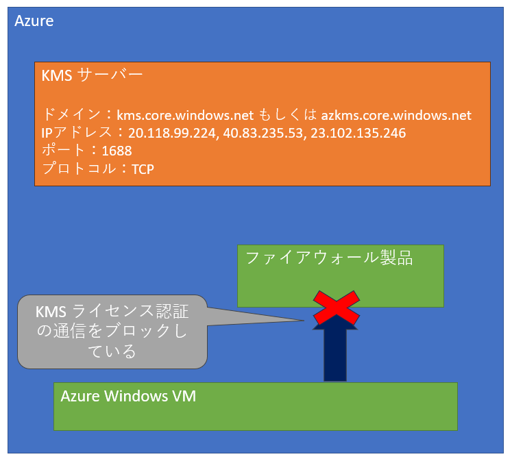

このような場合は以下のいずれかの方法でご対応をお願いいたします。  

- 解決方法 1：UDR を用いてファイアウォールを経由しないルーティングを行う

UDR を用いて KMS サーバーへのライセンス認証の通信についてファイアウォールを経由しないようなルーティングとする方法となります。  
設定方法については、[「強制トンネリング環境（オンプレミス等を経由し直接通信となっていない）」](./#%E5%BC%B7%E5%88%B6%E3%83%88%E3%83%B3%E3%83%8D%E3%83%AA%E3%83%B3%E3%82%B0%E7%92%B0%E5%A2%83%EF%BC%88%E3%82%AA%E3%83%B3%E3%83%97%E3%83%AC%E3%83%9F%E3%82%B9%E7%AD%89%E3%82%92%E7%B5%8C%E7%94%B1%E3%81%97%E7%9B%B4%E6%8E%A5%E9%80%9A%E4%BF%A1%E3%81%A8%E3%81%AA%E3%81%A3%E3%81%A6%E3%81%84%E3%81%AA%E3%81%84%EF%BC%89) セクションの解決方法と同じになりますので、そちらをご参照ください。  

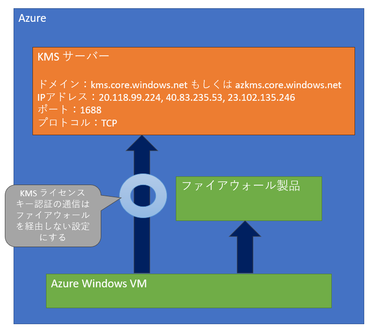

- 解決方法 2：ファイアウォール製品でライセンス認証の通信を許可する

先述の通り、ライセンス認証には以下の通信要件が必要でございますので、お使いのファイアウォール製品で Azure VM からの以下の通信を許可する設定をお願いいたします。  

| 項目 | 通信要件 |
| -- | -- |
| ドメイン | kms.core.windows.net および azkms.core.windows.net |
| IP アドレス | 20.118.99.224, 40.83.235.53, 23.102.135.246 |
| ポート | 1688 |
| プロトコル | TCP |

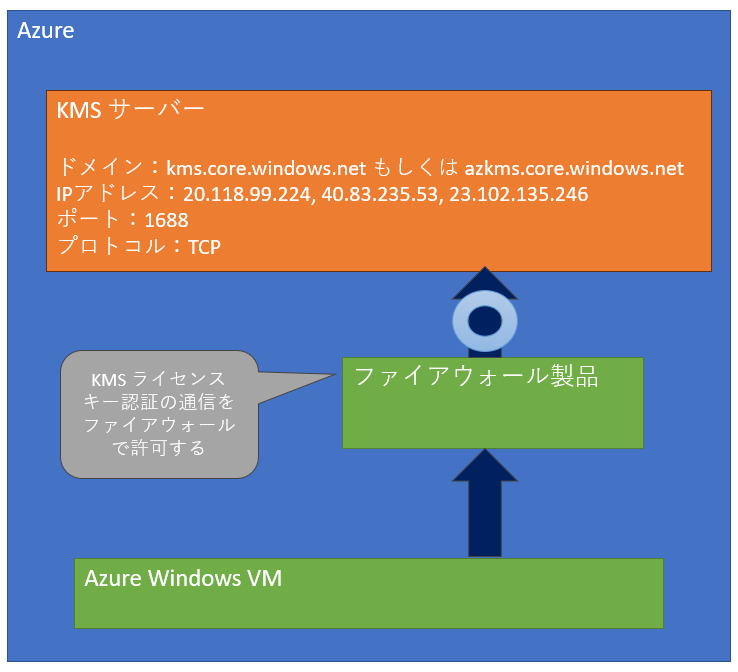

上手く改善されない場合は原因切り分けのために「解決方法 1：UDR を用いてファイアウォールを経由しないルーティングを行う」の方を実施していただけますと幸いです。

---
### 強制トンネリング環境（オンプレミス等を経由し直接通信となっていない）

KMS サーバーは Azure 上の VM からの直接通信のみを受け付ける動作となっております。  
そのため、Azure VM から送信される通信を強制トンネリングを用いて VPN / ExpressRoute を通過し、オンプレミス環境を経由するような設定を頂いている場合は、ライセンス認証が失敗いたします。  


このオンプレミス環境で KMS サーバーに接続できるような設定をしたとしても、実際のライセンス認証実行にて認証ができない状況となりますので留意ください。

■ご参考：強制トンネリングを使用したライセンス認証の問題
https://learn.microsoft.com/ja-jp/troubleshoot/azure/virtual-machines/custom-routes-enable-kms-activation

- 解決方法：UDR を用いてファイアウォールを経由しないルーティングを行う

Azure 上の VNET に属する Subnet 単位で UDR（User Defined Route）を用いて、特定 IP アドレスへの通信のルーティングを変更することが可能です。  
すなわち、KMS サーバー（20.118.99.224, 40.83.235.53, 23.102.135.246）への通信のみ、直接通信とするために Next Hop を Internet にします。


ポータルからこの設定を行う、具体的な手順をご紹介させていただきます。  

まずは対象の Azure VM の画面にて右側のメニューより「ネットワーク」を選択肢し、対象の仮想ネットワーク / サブネットのリンクを選択します。

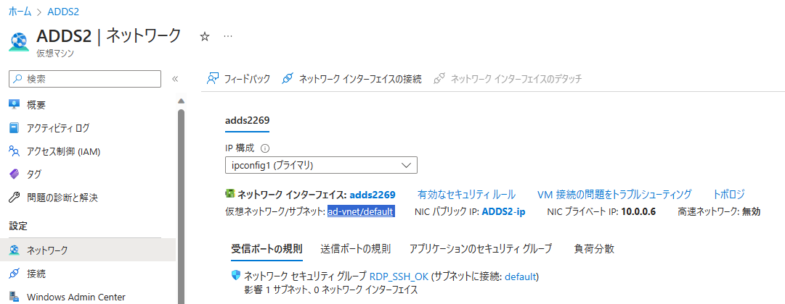

対象の Subnet に設定されているルート テーブル名を選択します。


左側のメニューより「ルート」を選択し「追加」より、KMS サーバーへの通信のみ、直接通信とするために Next Hop を Internet とするルートを 3 つそれぞれ作成します。  
アドレス プレフィックスには、それぞれ以下の値をご入力ください。  

| アドレス プレフィックス |
| --- |
| 20.118.99.224/32 |
| 40.83.235.53/32 |
| 23.102.135.246/32 |

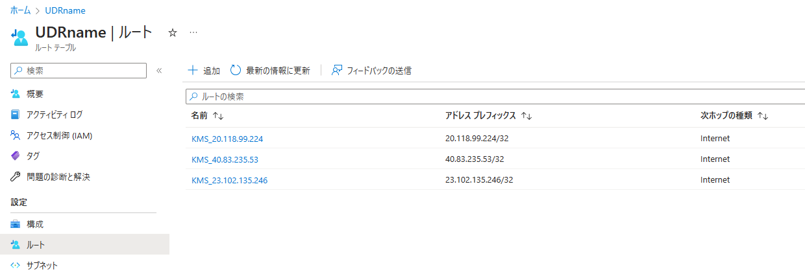

これで、KMS ライセンス認証の通信を直接 KMS サーバーと通信するルーティングテーブルの設定ができました。

---
### Standard SKU の Azure Load Balancer 配下の VM で外部接続ができない

Standard SKU の Azure Load Balancer 配下の VM の場合、外部接続ができない状態となっていることに伴い KMS ライセンス認証の通信ができない場合がございます。  
また、可用性セットの VM の場合、同一可用性セット内の別の VM が Standard SKU の Azure Load Balancer 配下にあると、同じく外部通信ができない状況が発生します。  

このような Standard SKU の Azure Load Balancer 配下の VM の場合は、KMS サーバーへの通信ができるように明示的に外部接続のポリシーを構成する必要がございます。  
こちらのシナリオについては別途解説を行っているブログ記事がございますので、こちらをご参照くださいませ。

■ご参考：Azure VM の外部接続 (SNAT) オプション まとめ
https://jpaztech.github.io/blog/network/snat-options-for-azure-vm/

---
### Tokens.dat ファイルの破損

ライセンス認証を行ったところ以下のように「エラー コード: 0xC004E015 / 0xC004D301 / 0xC004E002」といったエラーが表示される場合がございます。  

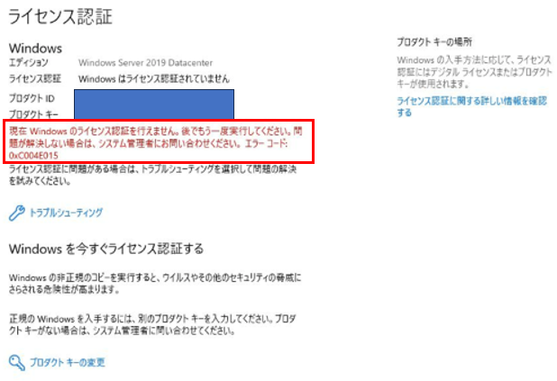

この場合は Tokens.dat ファイルの破損が発生している可能性がございます。  
以下の公開情報の手順で、Tokens.dat ファイルの再構築を行った後に、手動のライセンス認証が成功するかお試しいただけますと幸いです。

■ご参考：Tokens.dat ファイルの再構築
https://learn.microsoft.com/ja-jp/windows-server/get-started/activation-rebuild-tokens-dat-file

---
## さいごに（その他の要因等について）

以上がトラブルシューティングおよび、よくあるトラブルのパターンとなりますが、稀に上記以外の要因でもライセンス認証の失敗の可能性もございます。  

【例】
- OS 内部のファイアウォールでの KMS ライセンス認証通信のブロック
- ライセンスキーが正常に登録されていない

これらのシナリオに該当しない可能性もございますので、上記のトラブルシューティングで改善しない場合は、実施したトラブルシューティングの内容や対象の VM の情報などを添えて弊社の技術サポート窓口にお問い合わせをいただけますと幸いでございます。  
上述の内容が皆様のお役に立つことを願っております。
