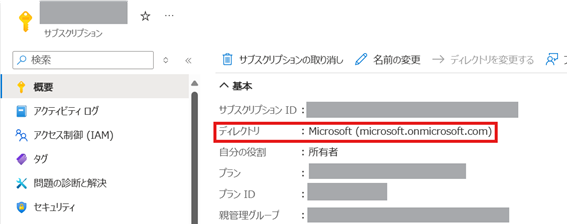
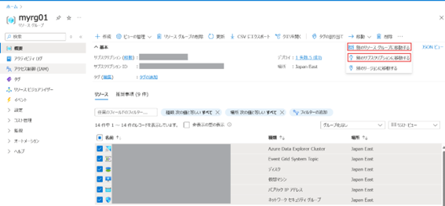

今回は、お問い合わせいただくことの多い Azure VM の複製 / 移動方法ついてのまとめの記事となります。 

<!-- more -->

- 同一サブスクリプション内での Azure VM の複製 / 移動 
- テナントは同じだが別のサブスクリプションへの Azure VM の複製 / 移動 
- 別のテナントにある別のサブスクリプションへの Azure VM の複製 / 移動 

どのパターンにも対応した記事となっております。  
なお、あくまで複製 / 移動方法の例をご紹介するものとなります点、ご承知おきいただけますと幸いです。 

まず、手順については複製 / 移動先のテナントが同じか別かによって大きく手順が変わります。   
そのため、本記事では以下の通り 4 つのパターンに分けて手順をご紹介させていただきます。 

| 複製 / 移動先は同じテナントか？ | 実施する内容は複製か移動か？ | シナリオ |
| ---- | ---- | ---- |
| 同じテナント内 | VM 複製（コピー）を行う | シナリオ 1 |
| 同じテナント内 | VM の移動をする | シナリオ 2 |
| 別テナント | VM 複製（コピー）を行う | シナリオ 3 |
| 別テナント | VM の移動をする | シナリオ 4 |

## 前提条件

今回は VM の一般化は行わず、完全複製での移動・複製をする場合の手順となります。  
一般化してイメージを展開する場合は、以下のドキュメントに記載の ACG (Azure Compute Gallery) のご利用をご検討くださいませ。  

[(参考) Azure Compute Gallery でリソースを格納、共有する](https://learn.microsoft.com/ja-jp/azure/virtual-machines/azure-compute-gallery)

また、Windows VM を一般化せず複製して利用いただくことが原則叶いません点ご留意ください。

[(参考) Windows VMを複製しようとしている方への注意喚起](https://jpaztech.github.io/blog/vm/vm-replica-1/#Windows-VM%E3%82%92%E8%A4%87%E8%A3%BD%E3%81%97%E3%82%88%E3%81%86%E3%81%A8%E3%81%97%E3%81%A6%E3%81%84%E3%82%8B%E6%96%B9%E3%81%B8%E3%81%AE%E6%B3%A8%E6%84%8F%E5%96%9A%E8%B5%B7)

---

## 同一テナントか否かの確認

先述の通り、移動・複製元 (以降、”ソース”) と移動・複製先 (以降、”ターゲット”) のテナントが同一であるか否かによって方法が大きく異なります。
まずは、これを確認する手順をご案内いたします。

ソース サブスクリプションとターゲット サブスクリプションが同一テナント配下に属しているか確認します。  
Azure Portal のサブスクリプションページの「基本」タブの「ディレクトリ」にてサブスクリプションが属しているテナントがご確認いただけます。

それでは、それぞれのシナリオに応じた方法を確認していきましょう。

---

## シナリオ 1 - 同一テナント内での VM の複製（コピー）

このシナリオの場合、OS ディスクのスナップショットから VM を複製として作成することが可能です。  
同一テナント内であればサブスクリプションを跨いだ複製の場合も、ユーザーが両方のサブスクリプションを操作できる権限があればこの手順が使用可能です。   
手順の詳細につきましては、以下の弊社ブログをご参考ください。   

[(参考) VM 複製方法について part.3/3 OS ディスクのスナップショットから複製する手順](https://jpaztech.github.io/blog/vm/vm-replica-3/)

---

## シナリオ 2 - 同一テナント内での VM 移動

同一テナント内での VM 移動として、考えられるシナリオとしては、以下のようなものが考えられます。

**A：同一テナント内でのリソースグループの移動**  
**B：同一テナント内でのサブスクリプションの移動**  
**C：同一テナント内でのリージョンの移動**  
**D：同一テナント内でのVNETの移動**  

それぞれ以下の通り紹介させていただきます。

---

### A：同一テナント内でのリソースグループの移動 および B：同一テナント内でのサブスクリプションの移動

こちら両方について 2 つの方法が利用可能ですので、ご紹介させていただきます。

#### 方法 AB1:

移動したいリソースをチェックしていただき、 右上の「移動」のドロップダウンリストから「別のリソース グループに移動する」もしくは「別のサブスクリプションへ移動する」をクリックすることでリソースの移動ができます。

[(参考) リソースを新しいリソース グループまたはサブスクリプションに移動する - ポータルの使用](https://learn.microsoft.com/ja-jp/azure/azure-resource-manager/management/move-resource-group-and-subscription#use-the-portal)

移動を実施いただく前に、移動対象のリソースに対して検証が実行されますが、 何かしらの原因により移動が叶わない場合、「検証状態」が「失敗」と表示され、 「エラーの詳細」から詳細な原因が確認いただけます。 

本手順については以下のドキュメントもご参照いただけますと幸いです。

[(参考) 仮想マシンをリソース グループまたはサブスクリプションに移動するという特殊なケースの処理](https://learn.microsoft.com/ja-jp/azure/azure-resource-manager/management/move-limitations/virtual-machines-move-limitations)

#### 方法 AB2:

先述の「シナリオ 1 - 同一テナント内での VM の複製（コピー）」の方法で VM を複製した後に元の VM を削除する手順となります。
上記 AB1 の方法が対応していない場合などにもご利用いただけます。

---

### C：同一テナント内でのリージョンの移動

同一テナント内でのリージョンの移動についても、以下の 2 種の方法をご紹介させていただきます。

#### 方法 C1：

Azure Resource Mover を使用してリージョン間でリソースを移動することが可能でございます。  
詳細については以下のドキュメントをご参照ください。

[(参考) Azure Resource Mover を使用してリージョン間で (リソース グループから) リソースを移動する](https://learn.microsoft.com/ja-jp/azure/resource-mover/move-region-within-resource-group)

#### 方法 C2：

後述の「シナリオ 3 - 別のテナントへの VM の複製（コピー）」と同じ手順で VM 複製を行った後に、元の VM の削除を行います。

---

### D：同一テナント内での VNET の移動

VM を別の VNET へ移動する場合は、以下の方法で VM 再作成が必要となります。

[(参考) 設定変更不可の項目を VM 再作成により再設定する手順](https://jpaztech.github.io/blog/vm/recreate-vm-to-change-settings/)

---

## シナリオ 3 - 別のテナントへの VM の複製（コピー）

テナントを跨いでコピーしたい場合は、そのテナントへディスクを転送してから VM 作成をいただく必要があります。  
その方法についての 2 通りの方法をご紹介させていただきます。

### Azure Storage Explorer

GUI ツールを利用したコピー方法です。こちらは、コマンド無しで VM を別のリージョン・サブスクリプション・テナントに複製が可能です。  
こちらの手順につきましては、弊社ブログにて詳細手順をご確認いただけますので、ぜひ参考にしてください。

[(参考) Azure Storage Explorer を用いて、コマンド無しで VM を別のリージョン・サブスクリプション・テナントに移動/複製をしてみよう](https://jpaztech.github.io/blog/vm/copy-vm-with-storage-explorer/)

### Azcopy コマンド

コマンドを用いた方法となります。
弊社ブログにて詳細な手順をご紹介しておりますのでこちらをご参照くださいませ。
 
[(参考) Azure VM からエクスポートした VHD ファイルを用いた複製 VM の作成方法](https://jpaztech.github.io/blog/vm/create-vm-using-vhd/)

>[!WARNING]
>どちらの手順も VHD ファイルからディスクを作成する際に VM の世代をソース VM の世代と合わせる必要があります。

---

## シナリオ 4 - 別のテナントへの VM 移動

テナントを跨いで VM を移動したい場合は、上記の「シナリオ 3 - 別のテナントへの VM の複製（コピー）」の手順を用いて VM 複製をした後に、元の VM を削除します。

> [!TIP]
>別のテナントへの VM の複製 / 移動の方法として、サブスクリプション自体を別のテナントに移転してしまうという方法もございます。  
>他方、影響は大きなものとなりますので、参考情報としてのご紹介となります。  
>[(参考)  Azure サブスクリプションを別の Microsoft Entra ディレクトリに移転する](https://learn.microsoft.com/ja-jp/azure/role-based-access-control/transfer-subscription)

以上が各シナリオにおける VM の複製 / 移動の方法のまとめでした。  
これらの情報が皆様のお役に立てますと幸いでございます。
